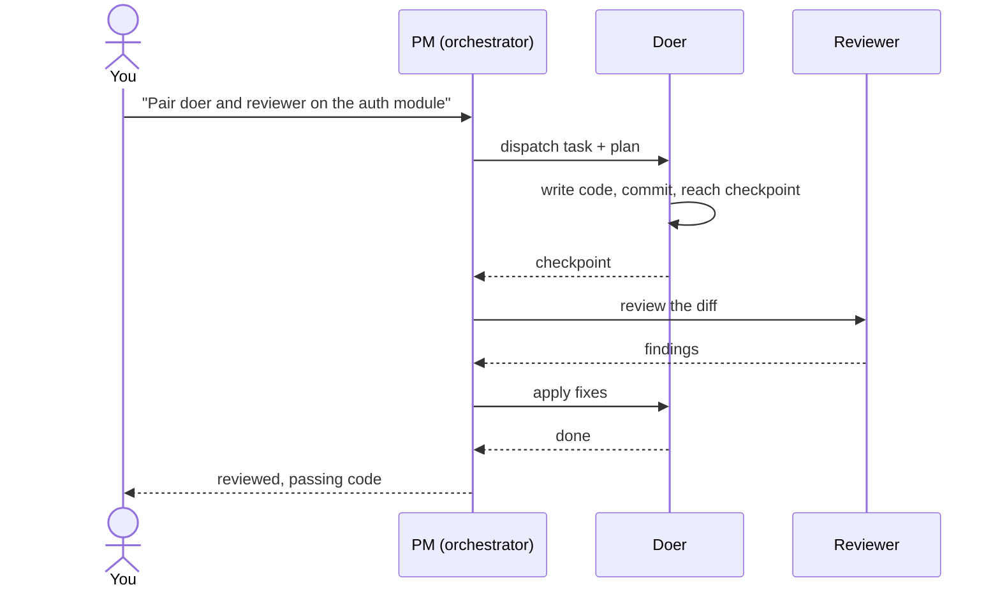

# Apra Fleet

[](https://github.com/Apra-Labs/apra-fleet/actions/workflows/ci.yml)
[](https://opensource.org/licenses/Apache-2.0)
[](https://github.com/Apra-Labs/apra-fleet/releases)
[](https://modelcontextprotocol.io)

### One conversation. A team of AI agents that plan, build, review each other's work, and run across every machine you own.

Apra Fleet is an open-source **MCP server** that turns AI coding agents
(Claude Code, Gemini, Codex, Copilot) into a coordinated team instead of a lone
assistant. Describe a goal -- a Project Manager agent breaks it down, dispatches
the work, pairs a reviewer against every change, and hands you code that has
already passed a second set of eyes. Need more horsepower? Fleet reaches across
every machine on your network over SSH -- no dashboards, no orchestration YAML,
just conversation.

> A *member* is one working folder plus one LLM CLI -- local or remote.
> A fleet is however many of those you register, working in concert.

### Watch a real run (3 min)

[](https://youtu.be/SGdHvIkSbY8)

Two agents ship a feature end to end: one plans and writes, the other reviews,
fixes loop back, and a clean diff lands -- driven by the **PM skill**. That is
*one* of the workflows Fleet makes possible; the rest are below.

---

## See it in one example

```
You:    Pair local-1 and local-2. local-1 builds the auth module,
        local-2 reviews it.

Fleet:  doer (local-1)      writes auth module, commits, hits checkpoint
        reviewer (local-2)  reads the diff -> 2 findings, 1 blocking
        doer (local-1)      applies fixes, re-commits
        PM                  review clean -> handed back to you
```

Every change gets a second pair of eyes before it reaches yours. This runs on a
**single machine** (two local agents) just as well as across a network.

## Quick start

Copy-paste the one-liner for your platform:

**macOS (Apple Silicon)**
```bash
curl -fsSL https://github.com/Apra-Labs/apra-fleet/releases/latest/download/apra-fleet-installer-darwin-arm64 -o apra-fleet-installer && chmod +x apra-fleet-installer && ./apra-fleet-installer install
```

**Linux (x64)**
```bash
curl -fsSL https://github.com/Apra-Labs/apra-fleet/releases/latest/download/apra-fleet-installer-linux-x64 -o apra-fleet-installer && chmod +x apra-fleet-installer && ./apra-fleet-installer install
```

**Windows (x64)** -- run in PowerShell:
```powershell
Invoke-WebRequest -Uri https://github.com/Apra-Labs/apra-fleet/releases/latest/download/apra-fleet-installer-win-x64.exe -OutFile apra-fleet-installer.exe; .\apra-fleet-installer.exe install
```

Then load it in Claude Code with `/mcp` and register your first members:

> "Register a local member called `doer`. Register another called `reviewer`.
> Pair them."

Add remote machines whenever you are ready:

> "Register 192.168.1.10 as `build-server`. Username akhil, password auth,
> work folder `/home/akhil/projects/myapp`."

Intel Mac users: build from source -- see [Development](#development).
Install details (what it writes, the `--skill` flag, uninstall, self-update) are
in [docs/install.md](docs/install.md).

## How it works



The PM orchestrator talks to members through Fleet's MCP tools; Fleet carries the
work to each member -- locally as a child process, or remotely over SSH. Agents
sync state through git (`PLAN.md`, `progress.json`, `feedback.md`), so progress
survives restarts.

## What you can build on top

Fleet is a coordination layer. The **PM skill** is its reference workflow library
and ships today; the rest are recipes you assemble with the same tools.

| Workflow | What it does | Status |
|----------|--------------|--------|
| **Doer / Reviewer** | Two agents pair: one writes, one reviews against a quality bar. | Ships (PM skill) |
| **Plan / execute / verify** | Break work into steps, approve the plan, agents pause at checkpoints. | Ships (PM skill) |
| **Pipeline** | Agent A extracts, B transforms, C ships -- handoff by file. | Recipe |
| **Specialist routing** | Route Python work to a py-agent, Rust to a rust-agent. | Recipe |
| **Parallel exploration** | Three agents try three approaches; you merge the winner. | Recipe |
| **Cross-machine** | Build on Linux, test on Windows, deploy from a Mac. | Recipe |

To write your own skill, see [docs/writing-skills.md](docs/writing-skills.md).

## Use cases

- Run your test suite on a Linux box while you develop on macOS.
- Have one agent build the frontend, another the backend, a third running tests
  -- all in parallel.
- Use a beefy cloud VM for compilation while coding from your laptop.
- Spin up isolated workspaces on one machine without them stepping on each other.
- Non-coding ops: log triage, patch fan-out, infrastructure surveys.

## Cost

Multi-agent tooling raises one question first: does coordinating several agents
burn more tokens? In practice Fleet works to keep usage down, three ways:

- **Right-sized models** -- simple tasks route to lighter, cheaper model tiers;
  only hard work reaches premium models.
- **Shell over prompts** -- routine steps run through `execute_command` as plain
  shell commands, which cost zero LLM tokens.
- **Smart sessions** -- Fleet decides whether to resume an existing session
  (reusing cached context) or start fresh, rather than re-sending history.

Setup is a one-time cost; the recurring cost is the work itself. See the
[FAQ](docs/FAQ.md) for the full breakdown.

## Compare to alternatives

| Tool | Overlap | Where Fleet differs |
|------|---------|---------------------|
| Single-agent coding assistants | AI writes code | Fleet adds a second agent that reviews before you do. |
| CI self-hosted runners | Runs work on other machines | Fleet is conversational and stateful, not pipeline-triggered. |
| SkyPilot / dstack | Multi-machine compute | Fleet coordinates *agents and their context*, not just jobs. |
| Google A2A | Agent-to-agent messaging | Fleet is an opinionated workflow layer, not just a transport. |

When *not* to use Fleet: a one-off single-file change needs no second agent.

## Providers

Fleet members can each run a different LLM backend. Mix by role:

| Role | Recommended | Why |
|------|-------------|-----|
| PM (orchestrator) | Claude (Opus or Sonnet) | Most thoroughly tested for planning. |
| Doer | Any provider | Sonnet, Gemini, Codex, Copilot -- mix freely. |
| Reviewer | Premium-tier models | Catches subtle issues smaller models miss. |

A fleet that has run in production:

```
pm-1      Opus 4.7     orchestrator
doer-1    Sonnet 4.6   feature work
doer-2    Gemini       large-context tasks
reviewer  Opus 4.7     final review
```

Full capability comparison and provider gotchas:
[docs/provider-matrix.md](docs/provider-matrix.md).

## The PM skill

The Project Manager skill is installed by default and drives structured,
multi-step work: planning with your approval, doer-reviewer loops, verification
checkpoints, and git-synced progress. Task state persists across sessions via
**Beads** (`bd` CLI, installed alongside Fleet) -- run `bd ready` any time to see
what is in flight.

| Command | Does |
|---------|------|
| `/pm init <project>` | Initialize a project. |
| `/pm pair <member> <member>` | Pair a doer with a reviewer. |
| `/pm plan <requirement>` | Draft a plan for your approval. |
| `/pm start <member>` | Begin execution. |
| `/pm status <member>` | Check in-flight work. |
| `/pm cleanup <project>` | Finish up and raise a PR. |

See [skills/pm/SKILL.md](skills/pm/SKILL.md) for the full command reference.

## Anatomy of a skill

A skill is a markdown file plus optional helper scripts in your provider's skills
directory (for Claude, `~/.claude/skills/`). It uses Fleet's MCP tools
(`register_member`, `execute_prompt`, `send_files`, ...) to coordinate agents. PM
is one such skill. To build your own, start with
[docs/writing-skills.md](docs/writing-skills.md).

## Documentation

| Topic | Link |
|-------|------|
| Install, uninstall, update | [docs/install.md](docs/install.md) |
| Registering members and SSH | [docs/ssh-setup.md](docs/ssh-setup.md) |
| Secure credentials and passwords | [docs/features/oob-auth.md](docs/features/oob-auth.md) |
| Git authentication | [docs/design-git-auth.md](docs/design-git-auth.md) |
| Provider matrix | [docs/provider-matrix.md](docs/provider-matrix.md) |
| Cloud compute | [docs/cloud-compute.md](docs/cloud-compute.md) |
| Troubleshooting | [docs/troubleshooting.md](docs/troubleshooting.md) |
| FAQ | [docs/FAQ.md](docs/FAQ.md) |
| Architecture | [docs/architecture.md](docs/architecture.md) |

## Community

- Questions and ideas: [GitHub Discussions](https://github.com/Apra-Labs/apra-fleet/discussions)
- Releases: [GitHub Releases](https://github.com/Apra-Labs/apra-fleet/releases)
- Issues: [GitHub Issues](https://github.com/Apra-Labs/apra-fleet/issues)
- What is planned next: [ROADMAP.md](ROADMAP.md)

If Apra Fleet helped you ship faster with better quality, please
[star the repo](https://github.com/Apra-Labs/apra-fleet) -- it helps others
find it.

## Development

Build from source (also the path for Intel Macs):

```bash
git clone https://github.com/Apra-Labs/apra-fleet && cd apra-fleet
npm install && npm run build && npm test
```

See [CONTRIBUTING.md](CONTRIBUTING.md) to contribute.

## License

Apache 2.0 -- see [LICENSE](LICENSE).
