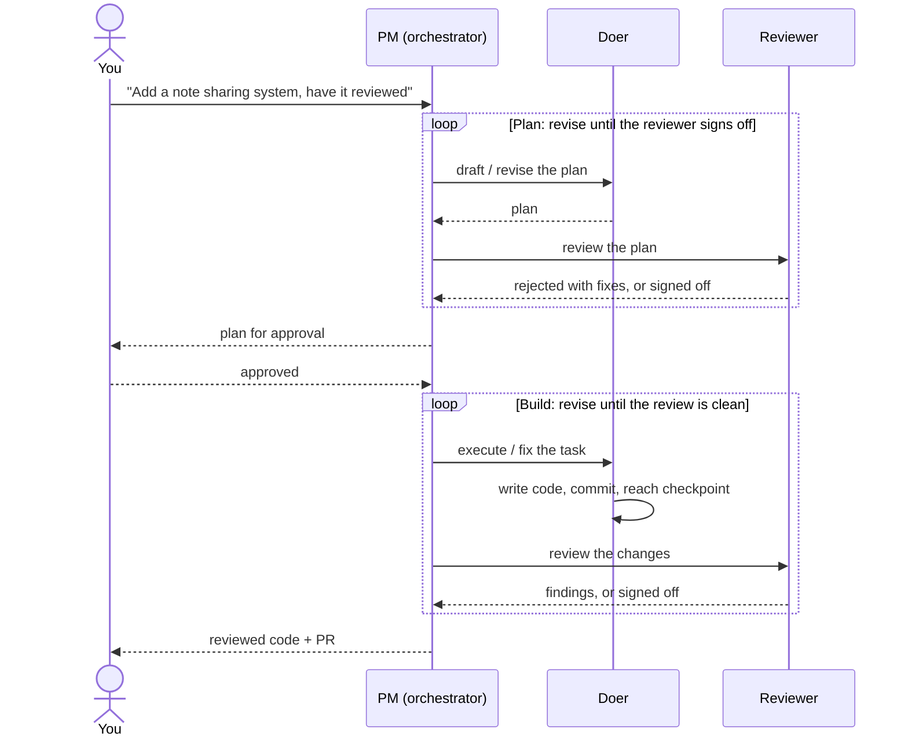

# Apra Fleet

[](https://github.com/Apra-Labs/apra-fleet/actions/workflows/ci.yml)
[](https://opensource.org/licenses/Apache-2.0)
[](https://github.com/Apra-Labs/apra-fleet/releases)
[](https://modelcontextprotocol.io)
[](https://deepwiki.com/Apra-Labs/apra-fleet)

### One goal. A team of AI agents that plan, execute, and review each other's work, and run across every machine you own.

Apra Fleet is an open-source **MCP server** that turns AI agents (Claude
Code, Antigravity, Codex, Copilot, Gemini, OpenCode) into a coordinated team instead of a lone
assistant. Any job that needs more than one agent -- software sprints,
customer-support triage, cost and operations-efficiency analysis,
infrastructure surveys -- becomes a fleet you direct in plain conversation.
Need more horsepower? Fleet reaches across every machine on your network
over SSH -- no dashboards, no orchestration YAML.

**The agents need not share a vendor.** A Claude agent and an Antigravity agent can
work the same sprint -- one writes, the other reviews -- so a different model,
with different blind spots, checks every change. Cross-provider collaboration is
a built-in quality mechanism, not an afterthought.

> A *member* is one working folder plus one LLM CLI -- local or remote.
> A fleet is however many of those you register, working in concert.

### Watch a real run (3 min)

[](https://youtu.be/SGdHvIkSbY8)

Two agents ship a feature end to end: one plans and writes, the other reviews,
findings loop back, and a clean diff lands -- driven by the **PM skill**. That is
*one* of the workflows Fleet makes possible; the rest are below.

---

## See it in one example

```
/pm add 2 local members at c:\projects cloned from <git-url> -- a developer and a reviewer -- and pair them
/pm init project_icarus
/pm plan ./feature.md
/pm start the implementation sprint
/pm status
```

You describe the goal, approve the plan once, and Fleet runs the doer-reviewer loop to a reviewed PR.

## Quick start

### Option A -- npm (all platforms, requires Node.js 22+)

```bash
npm install -g @apralabs/apra-fleet
apra-fleet                          # Claude Code (default) -- install is the default action
apra-fleet --llm agy               # Google Antigravity CLI
apra-fleet --llm gemini            # Gemini CLI
apra-fleet --llm codex             # OpenAI Codex CLI
apra-fleet --llm opencode          # OpenCode (local/self-hosted models)
```

Run once per provider you want to support. After install, load the
server in Claude Code using `/mcp`, or restart your CLI for other providers.

### Option B -- standalone binary (no Node.js required)

Download the installer for your platform from
[GitHub Releases](https://github.com/Apra-Labs/apra-fleet/releases) and
**double-click it** (or run it from the terminal) -- installation is the default action.

**macOS (Apple Silicon)**
```bash
curl -fsSL https://github.com/Apra-Labs/apra-fleet/releases/latest/download/apra-fleet-installer-darwin-arm64 -o apra-fleet-installer && chmod +x apra-fleet-installer && ./apra-fleet-installer
```

**Linux (x64)**
```bash
curl -fsSL https://github.com/Apra-Labs/apra-fleet/releases/latest/download/apra-fleet-installer-linux-x64 -o apra-fleet-installer && chmod +x apra-fleet-installer && ./apra-fleet-installer
```

**Windows (x64)** -- download `apra-fleet-installer-win-x64.exe` and double-click, or run in PowerShell:
```powershell
Invoke-WebRequest -Uri https://github.com/Apra-Labs/apra-fleet/releases/latest/download/apra-fleet-installer-win-x64.exe -OutFile apra-fleet-installer.exe; .\apra-fleet-installer.exe
```

> Installing for **Antigravity**, Codex, Copilot, Gemini, or **OpenCode** instead of
> Claude? Add the `--llm` flag -- see
> [Install for other providers](docs/install.md#install-for-other-providers-antigravity-codex-copilot-gemini).

Then load it in your favorite LLM CLI (claude, agy, gemini, ...) using `/mcp`.

Now register your first members:

> "Register a local member called `doer`. Register another called `reviewer`.
> Pair them."

Verify it worked:

> "Show me fleet status."

You should see both members listed with status online or idle, grouped by
category if any have been assigned one. Members carry keyword `tags` (up to 10,
64 chars each) used for filtering in `list_members`, driving tag-aware permission
profile composition in `compose_permissions`, and skill-matrix matching during
onboarding. See [docs/features/member-tags.md](docs/features/member-tags.md).

Add remote machines whenever you are ready:

> "Register 192.168.1.10 as `build-server`. Username akhil, work folder
> `/home/akhil/projects/myapp`."

Fleet securely collects the machine's password out-of-band -- you type it into a
separate terminal, never the chat -- uses it once to set up SSH key-based auth,
then forgets it. Every connection after that is key-based.

Intel Mac users: build from source -- see [Development](#development).
Install details (what it writes, the `--skill` flag, uninstall) are in
[docs/install.md](docs/install.md).

**Staying current is one command.** `apra-fleet update` checks GitHub for the
latest release and installs it in place -- or tells you that you are already up
to date. See [keeping Fleet updated](docs/features/update.md).

## How it works



A sprint runs in two reviewed phases: the **plan** is drafted, reviewed, and
approved by you before any code is written; then the **build** is executed and
every phase of development is reviewed against all the project documents
(requirements, plan, design, etc.). The PM orchestrator talks to members through Fleet's MCP
tools; Fleet carries the work to each member -- locally as a child process, or
remotely over SSH. Agents sync state through git (`PLAN.md`, `progress.json`,
`feedback.md`), so progress survives restarts.

## What you can build on top

Fleet is a coordination layer. The **PM skill** is its reference workflow library
and ships today; the rest are recipes you assemble with the same tools.

| Workflow | What it does | Status |
|----------|--------------|--------|
| **Doer / Reviewer** | Two agents pair: one writes, one reviews against a quality bar. | Ships (PM skill) |
| **Plan / execute / verify** | Break work into steps, approve the plan, agents pause at checkpoints. | Ships (PM skill) |
| **Pipeline** | Agent A extracts, B transforms, C ships -- handoff by file. | Recipe |
| **Specialist routing** | Route Python work to a py-agent, Rust to a rust-agent. | Recipe |
| **Parallel exploration** | Three agents try three approaches; you merge the winner. | Recipe |
| **Cross-machine** | Build on Linux, test on Windows, deploy from a Mac. | Recipe |

To write your own skill, see [docs/writing-skills.md](docs/writing-skills.md).

## Use cases

- Run your test suite on a Linux box while you develop on macOS.
- Have one agent build the frontend, another the backend, a third running tests
  -- all in parallel.
- Use a beefy cloud VM for compilation while coding from your laptop.
- Spin up isolated workspaces on one machine without them stepping on each other.
- Customer-support triage: agents classify, draft replies, and escalate
  tickets in parallel.
- Cost and operations-efficiency analysis: fan out data gathering across
  sources, consolidate findings.
- Infrastructure surveys, log triage, and patch fan-out across many
  machines.

## Cost

Multi-agent tooling raises one question first: does coordinating several agents
burn more tokens? In practice Fleet works to keep usage down -- and the core
idea is the one Fleet was built on: **match the model to the task.**

A plan is a list of tasks of widely varying difficulty. Running every one of
them on a single premium model is the waste. Instead, Fleet assigns each task a
model tier commensurate with its complexity:

- **cheap** -- boilerplate, status checks, running tests, deploys
- **standard** -- routine feature work, code, configuration
- **premium** -- planning, review, hard architectural reasoning

Only the work that genuinely needs a frontier model gets one; everything else
runs on a lighter, cheaper tier. Two more mechanisms compound the savings:

- **Shell over prompts** -- routine steps run through `execute_command` as plain
  shell commands, which cost zero LLM tokens.
- **Smart sessions** -- Fleet decides whether to resume an existing session
  (reusing cached context) or start fresh, rather than re-sending history.

**Token spend is measured, not estimated.** Fleet records token usage per
member and per role -- PM, doer, reviewer -- so a team can see and analyze
where their spend actually goes. Fleet's end-to-end CI suite exercises this
in full: a complete reviewed sprint -- discover issues, plan, doer-reviewer
loop, PR raised with green CI -- emits a per-role token breakdown (in one
such run: PM ~6K, doer ~191K, reviewer ~19K, ~215K total). Those toy-repo
figures are not a benchmark -- they show the measurement method works end
to end. The point is the instrument: Fleet makes token cost something you
can attribute and reason about, not guess at.

Setup is a one-time cost; the recurring cost is the work itself. See the
[FAQ](docs/FAQ.md) for the full breakdown.

## Compare to alternatives

| Tool | Overlap | Where Fleet differs |
|------|---------|---------------------|
| Single-agent coding assistants | AI writes code | Fleet adds a second agent that reviews before you do. |
| CI self-hosted runners | Runs work on other machines | Fleet is conversational and stateful, not pipeline-triggered. |
| SkyPilot / dstack | Multi-machine compute | Fleet coordinates *agents and their context*, not just jobs. |
| Google A2A | Agent-to-agent messaging | Fleet is an opinionated workflow layer, not just a transport. |

When *not* to use Fleet: a one-off single-file change needs no second agent.

## Mix providers in one fleet

Every member runs its own LLM backend, and they collaborate across vendors. Put
a Claude doer with an Antigravity reviewer, or the reverse - the reviewer's model
disagrees with the doer's by construction, so it catches issues a same-model
review would wave through. Mix by role:

| Role | Recommended | Why |
|------|-------------|-----|
| PM (orchestrator) | Claude Code or Antigravity (agy) | Both plan and orchestrate well - both support planning, background tasks, and premium models (e.g., Opus / premium-tier). |
| Doer | Any provider | Sonnet, Antigravity, Codex, Copilot, Gemini, OpenCode - mix freely. |
| Reviewer | Premium-tier models | Catches subtle issues smaller models miss. |

A fleet that has run in production:

```
pm-1      Opus 4.7        orchestrator
doer-1    Sonnet 4.6      feature work
doer-2    Antigravity     large-context tasks
reviewer  Opus 4.7        final review
```

**OpenCode and local models.** OpenCode works with any OpenAI-compatible
endpoint (Ollama, vLLM, etc.), so it is the provider for self-hosted models.
The model endpoint is the user's responsibility -- Fleet installs the CLI and
agents but does not provision or manage the inference server. Configure the
provider and base URL in `opencode.json`; see
[docs/opencode-exploration.md](docs/opencode-exploration.md) for details.

Because OpenCode members can run any model, model tiers (cheap / standard /
premium) are set per member at registration via `model_tiers` in
`register_member`. A single-model entry fills all three tiers.

Provider strengths, role recommendations, and gotchas:
[docs/provider-guide.md](docs/provider-guide.md).

## The PM skill

The **PM skill** is Fleet's reference workflow for **software development**
-- it ships today, fully built out. It is one skill on a general
substrate: the same primitives -- members, tasks, git/SSH transport,
doer-reviewer pairing -- coordinate agents for support triage, cost
analysis, ops surveys, or any multi-agent job. PM is the worked example;
the platform is the point.

The Project Manager skill is installed by default and drives structured,
multi-step work: planning with your approval, doer-reviewer loops, verification
checkpoints, and git-synced progress. Task state persists across sessions via
[**Beads**](docs/beads.md), the bundled open-source issue tracker (`bd` CLI, installed alongside Fleet) -- run `bd ready` any time to see
what is in flight.

| Command | Does |
|---------|------|
| `/pm init <project>` | Initialize a project folder and templates. |
| `/pm pair <member> <member>` | Pair a doer with a reviewer. |
| `/pm plan <requirement>` | Draft a plan for your approval. |
| `/pm start <member>` | Begin execution; dispatches doer with plan and task harness. |
| `/pm status <member>` | Check in-flight tasks, progress, and git log. |
| `/pm resume <member>` | Resume after a verification checkpoint. |
| `/pm deploy <member>` | Execute the project deployment runbook. |
| `/pm recover <project>` | Re-orient after a PM restart; reads in-flight tasks and member state. |
| `/pm cleanup <project>` | Finish the sprint, close tasks, and raise a PR. |
| `/pm backlog` | Query and manage deferred items via Beads. |
| `/pm tasks` | Show the current sprint task tree. |
| `/auto-sprint` | Run a fully automated sprint loop with cost accounting. |

See [skills/pm/SKILL.md](skills/pm/SKILL.md) for the full command reference.

**Cost accounting.** When PM is installed, the installer also writes `cost.js`
to the PM skill directory for every provider. `cost.js` exports the seven pure
cost-computation functions (`computeSprintQuote`, `computeSprintAnalysis`,
`buildSprintSummary`, etc.) extracted from the `auto-sprint.js` workflow. For
Claude, the full `auto-sprint.js` is also copied to `~/.claude/workflows/` and
`Skill(auto-sprint)` / `Workflow(auto-sprint)` are added to the allow-list
automatically. See [docs/features/auto-sprint-install.md](docs/features/auto-sprint-install.md).

Want to build your own skill on top of Fleet? See [docs/writing-skills.md](docs/writing-skills.md).

## Documentation

| Topic | Link |
|-------|------|
| Codebase wiki (architecture, internals, AI Q&A) | [DeepWiki](https://deepwiki.com/Apra-Labs/apra-fleet) |
| Install, uninstall, the `--llm` flag | [docs/install.md](docs/install.md) |
| Choosing a provider | [docs/provider-guide.md](docs/provider-guide.md) |
| FAQ | [docs/FAQ.md](docs/FAQ.md) |
| Troubleshooting | [docs/troubleshooting.md](docs/troubleshooting.md) |
| Keeping Fleet updated (`apra-fleet update`) | [docs/features/update.md](docs/features/update.md) |
| Secure credentials and passwords | [docs/features/oob-auth.md](docs/features/oob-auth.md) |
| Member category and tags | [docs/features/member-tags.md](docs/features/member-tags.md) |
| Enabling SSH on a remote machine (if it does not have it yet) | [docs/ssh-setup.md](docs/ssh-setup.md) |
| Git authentication | [docs/design-git-auth.md](docs/design-git-auth.md) |
| Cloud compute | [docs/cloud-compute.md](docs/cloud-compute.md) |
| Architecture | [docs/architecture.md](docs/architecture.md) |

## Community

- Questions and ideas: [GitHub Discussions](https://github.com/Apra-Labs/apra-fleet/discussions)
- Releases: [GitHub Releases](https://github.com/Apra-Labs/apra-fleet/releases)
- Issues: [GitHub Issues](https://github.com/Apra-Labs/apra-fleet/issues)
- What is planned next: [ROADMAP.md](ROADMAP.md)

If Apra Fleet helped you ship faster with better quality, please
[star the repo](https://github.com/Apra-Labs/apra-fleet) -- it helps others
find it.

## Development

Build from source (also the path for Intel Macs):

```bash
git clone https://github.com/Apra-Labs/apra-fleet && cd apra-fleet
git submodule update --init
npm install && npm run build && npm test
```

See [CONTRIBUTING.md](CONTRIBUTING.md) to contribute.

## License

Apache 2.0 -- see [LICENSE](LICENSE).
