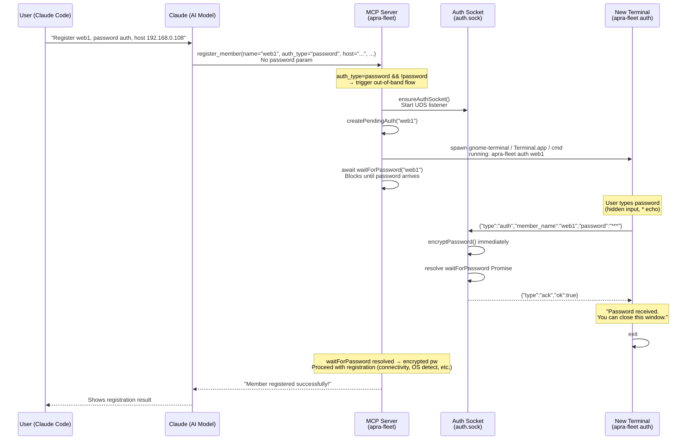
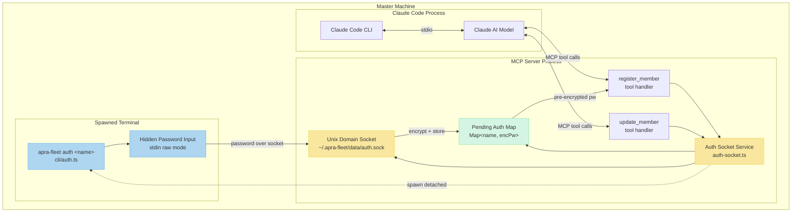

<!-- llm-context: Architecture Decision Record for how fleet collects passwords securely outside the LLM conversation. Covers the Unix domain socket approach, AES-256-GCM encryption, and cross-platform terminal support. Read when a user asks about password security or credential handling. -->
<!-- keywords: password, credential, security, out-of-band, OOB, encryption, AES-256-GCM, terminal, Unix domain socket -->
<!-- see-also: ../readme.md (SSH key migration), FAQ.md (credential security question) -->

# ADR: Out-of-Band Password Collection via Unix Domain Socket

**Status:** Implemented
**Date:** 2026-03-21
**Authors:** wayfaringbit + Claude

## Context

When `register_member` is called with `auth_type: "password"`, the password is passed as a tool parameter and enters Claude's conversation context. Claude can see, recall, and replay it for the rest of the session. This is a security concern — passwords should never enter the AI's context window.

### Problem

```
User → "register web1, password auth, password is hunter2"
                                                  ↑
                            Now visible in Claude's context forever
```

The MCP tool parameter path is: user message → Claude → tool call JSON → MCP server. The password travels through the AI model at every step.

### Constraints

- Cannot change how MCP tool parameters work (they always flow through the model)
- Must remain backwards-compatible (direct `password` param must still work for automation/scripts)
- No external dependencies allowed (the project uses only ssh2, zod, uuid)
- Must work cross-platform (Linux, macOS, Windows)

## Decision

Add a **Unix domain socket side-channel** with an **auto-launched terminal prompt**. When a password is needed but not provided in the tool params, the MCP server:

1. Starts a UDS listener at `~/.apra-fleet/data/auth.sock`
2. Creates a pending auth request keyed by member name
3. Auto-launches a new terminal window running `apra-fleet auth <member-name>`
4. **Blocks** — the tool handler awaits a Promise that resolves when the password arrives
5. The user sees a password prompt in the new window, types the password (hidden input)
6. The password flows over the socket to the MCP server, resolving the waiting Promise
7. Registration continues and completes — all in a single tool call

The key insight: the MCP server itself launches the terminal and blocks until the password arrives over the socket, so Claude only sees the final registration result — never the password. No retry needed.

## Architecture

### New Components

```
src/services/auth-socket.ts   — UDS server, pending auth state, terminal launcher
src/cli/auth.ts                — CLI subcommand for hidden password input
tests/auth-socket.test.ts      — 18 unit tests
```

### Modified Components

```
src/index.ts                   — auth CLI dispatch, cleanup on SIGINT/SIGTERM
src/tools/register-member.ts   — out-of-band flow before connectivity test
src/tools/update-member.ts     — out-of-band flow when switching to password auth; rotate_password schema field
```

### Data Flow



### Component Interaction



### Socket Protocol

Newline-delimited JSON over Unix domain socket:

| Direction | Message |
|-----------|---------|
| Client → Server | `{"type":"auth","member_name":"web1","password":"hunter2"}\n` |
| Server → Client (success) | `{"type":"ack","ok":true}\n` |
| Server → Client (error) | `{"type":"ack","ok":false,"error":"No pending auth for \"web1\""}\n` |

### Terminal Auto-Launch

Platform detection via `process.platform`:

| Platform | Strategy |
|----------|----------|
| **Linux** | Try in order: `gnome-terminal --`, `xterm -e`, `x-terminal-emulator -e`. Detect via `which`. |
| **macOS** | `osascript` → Terminal.app `do script` |
| **Windows** | `start cmd /c` |
| **Headless** | Fallback: return manual instructions for Claude to relay |

Binary path resolution:
- **SEA binary:** `process.execPath` (the binary itself)
- **Dev mode:** `process.argv[0]` (node) + path to `dist/index.js`

## Security Properties

| Property | Mechanism |
|----------|-----------|
| Password never in AI context | Socket side-channel bypasses MCP tool params entirely |
| Socket access restricted | File permissions `0o600` (owner-only) |
| Parent dir restricted | `~/.apra-fleet/data/` at `0o700` |
| Plaintext held briefly | `encryptPassword()` called immediately on socket receipt |
| Stale socket cleanup | Unlink-before-bind on startup; cleanup on SIGINT/SIGTERM |
| Request expiry | 10-minute TTL on pending auth entries |
| Single-use | Encrypted password consumed (deleted) on retrieval |

## Password Rotation

### Problem

`update_member` with `auth_type: "password"` on a member already using password auth triggers OOB
collection even when the caller is just echoing the current auth type (e.g., an LLM updating an
unrelated field like `work_folder` and mirroring back the existing auth state).

The naive fix — adding a guard `existing.authType !== 'password'` — eliminates the false trigger but
also eliminates the only secure path for password rotation. Inline passwords passed via the `password`
parameter enter the AI's context window and persist for the rest of the session, making OOB the only
safe option for rotating credentials.

### Decision

Add a `rotate_password: boolean` field to the `update_member` schema. OOB collection triggers on two
distinct predicates:

```typescript
const switchingToPassword = input.auth_type === 'password' && existing.authType !== 'password';
const rotatingPassword = !!input.rotate_password && existing.authType === 'password';
if ((switchingToPassword || rotatingPassword) && !input.password && existing.agentType === 'remote')
```

The `!input.password` guard ensures an inline password always wins and OOB is never triggered
unnecessarily.

### OOB Trigger Truth Table

| # | Existing | `auth_type` | `password` | `rotate_password` | OOB | Notes |
|---|---|---|---|---|---|---|
| 1 | password | _(none)_ | _(none)_ | _(none)_ | No | No auth change |
| 2 | password | _(none)_ | provided | _(none)_ | No | Inline pw update |
| 3a | password | `password` | _(none)_ | _(none)_ | **No** | LLM echo — bug fixed |
| 3b | password | _(none)_ | _(none)_ | `true` | **Yes** | Secure rotation via OOB |
| 3c | password | `password` | _(none)_ | `true` | **Yes** | Redundant but honored |
| 3d | password | _(none)_ | provided | `true` | No | Inline wins over flag |
| 4 | password | `password` | provided | _(none)_ | No | Inline pw rotation |
| 5 | password | `key` | _(none)_ | _(none)_ | No | Switching to key |
| 7 | key | _(none)_ | _(none)_ | _(none)_ | No | No auth change |
| 9 | key | `password` | _(none)_ | _(none)_ | **Yes** | Switching to password |
| 10 | key | `password` | provided | _(none)_ | No | Switch with inline pw |
| 13 | key | _(none)_ | _(none)_ | `true` | No | Not on pw auth, ignored |

## Backwards Compatibility

- `password` parameter remains optional — direct passing still works for automation/scripts
- If `password` is provided, the current in-band flow is used unchanged (no socket, no terminal)
- No changes to SSH, crypto, registry, or strategy layers
- The `auth` CLI subcommand also works standalone (user can run it manually if auto-launch fails)

## Edge Cases

| Scenario | Handling |
|----------|----------|
| Stale socket from crash | Unlink-before-bind |
| 10-min timeout | Expired entries cleaned up on access; user must re-trigger |
| Wrong member name in CLI | Socket responds with error, CLI prints it |
| Multiple concurrent registrations | Map keyed by member name, each independent |
| Password arrives before Claude retries | Encrypted password stored, returned immediately on next call |
| User provides password param AND runs CLI | Password param wins, pending request ignored |
| No display / headless server | `launchAuthTerminal` catches failure, returns manual instructions |
| Terminal emulator not found (Linux) | Falls through gnome-terminal → xterm → x-terminal-emulator → manual fallback |

## Test Coverage

23 unit tests in `tests/auth-socket.test.ts`:

- Pending auth lifecycle: create, check, resolve, expire, cleanup
- Socket server: accept auth + encrypt, error on unknown member, invalid JSON, invalid message format
- Idempotent `ensureAuthSocket()` (calling twice is safe)
- Socket file cleanup on close
- `getSocketPath()` returns correct platform-appropriate path
- `waitForPassword` resolves when password arrives via socket
- `waitForPassword` times out when no password arrives
- `waitForPassword` resolves immediately if password already arrived
- `cleanupAuthSocket` rejects pending waiters
- `collectOobPassword` returns immediately when password already pending
- `collectOobPassword` waits and resolves when pending without password
- `collectOobPassword` returns fallback on timeout
- `collectOobPassword` launches terminal and resolves on fresh call
- `collectOobPassword` returns fallback when terminal launch fails

## Alternatives Considered

### 1. Environment variable

Pass password via `APRA_FLEET_PASSWORD` env var. Rejected: env vars are visible in `/proc/<pid>/environ` and process listings. Also requires the user to set the var before starting Claude Code.

### 2. File-based exchange

Write password to a temp file, MCP server reads it. Rejected: race conditions, cleanup complexity, and the file sits on disk with the plaintext password.

### 3. Prompt within the MCP tool call

Have the MCP server block and prompt on its own stdin. Rejected: MCP servers communicate over stdio — stdin is the MCP transport, not a user terminal.

### 4. Separate HTTP server

Run a localhost HTTP endpoint for password submission. Rejected: opens a network port (even loopback has attack surface), requires CSRF protection, more complex than UDS.

## Verification

1. `npm run build` — zero type errors
2. `npm test` — 18/18 new tests pass, 272 existing tests pass
3. Manual test: register with `auth_type=password`, no password → terminal pops up → enter password → retry succeeds
4. Manual test (headless): `DISPLAY=` → returns manual instructions instead of auto-launching
5. Manual test (backwards compat): register with password in params → works as before
