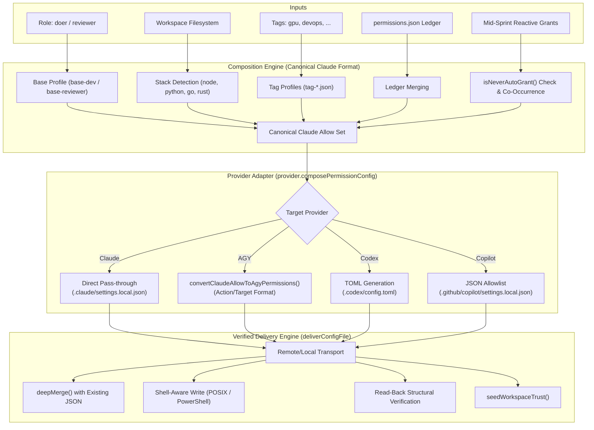

# Architecture & Specification: `compose_permissions` & AGY Provider Correction

**Document Status:** Approved Design, corrected by live verification (section 8). AGY binds a member to its own project with `--project <id>`; the folder-matching design (old sections 4.1-4.4 and 7) was removed.  
**Target Component:** `apra-fleet` MCP Server (`src/tools/compose-permissions.ts`, `src/providers/agy.ts`)  
**Reference Baseline:** Claude Code Provider (`src/providers/claude.ts`)  

---

## 1. Executive Summary

In Apra-Fleet, the `compose_permissions` tool is the single source of truth for provisioning least-privilege security boundaries to autonomous agents (*members*). It computes a composite permission set from roles (`doer` vs. `reviewer`), auto-detected technology stacks (Node, Python, Go, etc.), custom tags, and persistent project ledgers.

While the core composition engine uses **Claude Code's permission syntax as its canonical baseline**, each LLM provider adapter translates and writes those permissions to its native configuration files.

### 1.1 The Problem
The current implementation of the **AGY (Antigravity CLI) Provider** in `src/providers/agy.ts` is architecturally flawed:
1. It erroneously assumes AGY has no per-project configuration mechanism, documented in `agy.ts`:
   > *"AGY has no per-project config: it reads permissions only from the machine-global ~/.gemini/antigravity-cli/settings.json... A copy written under the member's work folder is never read..."*
2. It writes all permissions directly into the machine-wide `~/.gemini/antigravity-cli/settings.json`.
3. This creates **cross-member security leakage** (e.g. a restricted `reviewer` inherits a `doer`'s broad shell execution grants), destroys project isolation, and contaminates the host machine's interactive user settings.

### 1.2 The Solution
Antigravity implements project-scoped permissions via its project registry at `~/.gemini/config/projects/<project-id>.json`, but a headless run uses a project only when it is named with `--project <id>` (section 8). Each AGY member therefore owns one project, created with `agy --new-project` and recorded as `Agent.agyProjectId`; compose_permissions writes that member's grants into its project file and every dispatch passes `--project <agyProjectId>`. This document:
- Details the general `compose_permissions` architecture.
- Critiques the old global implementation.
- Records the live-verified binding mechanism and the answers to its open questions (section 8).

---

## 2. Core Architecture: `compose_permissions`

Apra-Fleet decouples permission *composition* from permission *delivery*. 



### 2.1 The Claude Baseline
All policy definitions in `skills/fleet/profiles/` are expressed in Claude Code format:
- **Filesystem Tools:** `Read`, `Write`, `Edit`, `Glob`, `Grep`
- **Path-Scoped Filesystem:** `Write(docs/**)`, `Edit(feedback.md)`
- **Shell Tools:** `Bash(git:*)`, `Bash(npm test:*)`
- **MCP Tools:** `mcp__<server>__<tool>` (e.g. `mcp__apra-fleet__kb_query`)

### 2.2 Hard Safety Constraints
When reactive grants (`grant: [...]`) are requested, `src/tools/compose-permissions.ts` enforces non-bypassable constraints:
1. **Wildcard Denylist:** Reject commands matching `Bash(sudo*)`, `Bash(su *)`, `Bash(doas*)`, `Bash(*bash -c*)`, `Bash(*sh -c*)`, `Bash(*eval*)`, `Bash(chmod 777*)`, `Bash(nc*)`, `Bash(nmap*)`, `Bash(env*)`.
2. **Chaining Metacharacters:** Rejects any payload containing `|`, `;`, `&&`, backticks (`` ` ``), or `$(`.
3. **Catch-All Ban:** Rejects bare wildcards like `Bash(*)`.

### 2.3 Delivery Engine & Verification
`deliverConfigFile` guarantees remote delivery integrity:
- **Transport Independence:** Executes identically via `LocalStrategy` (child_process) or `RemoteStrategy` (SSH).
- **Non-Destructive Deep Merge:** Preserves existing keys (such as `mcpServers.apra-fleet-member` JWT tokens).
- **Read-Back Verification:** Re-reads the file from disk, parses the JSON, and compares against `stableStringify(mergedContent)`. If anything mismatches, it throws `ConfigDeliveryError` and rolls back ledger updates.

---

## 3. Critique of Current AGY Provider Implementation

The current AGY provider implementation in `src/providers/agy.ts` contains serious architectural and security defects.

### 3.1 The Flawed Assumption
Lines 372-380 of `src/providers/agy.ts`:
```typescript
permissionConfigPaths(): string[] {
  // HOME-anchored, not work-folder-relative. AGY has no per-project config:
  // it reads permissions only from the machine-global
  // ~/.gemini/antigravity-cli/settings.json (same finding as
  // ensureWorkspaceTrusted's "no per-project trust concept"). A copy written
  // under the member's work folder is never read, so the member ran with an
  // empty allow-list and every headless tool call was auto-denied.
  return ['~/.gemini/antigravity-cli/settings.json'];
}
```

The author realized that writing to `<workFolder>/.gemini/...` did not work, and deduced that AGY had *no per-project configuration at all*. This conclusion was incorrect.

### 3.2 Consequences of Writing to Global `settings.json`

| Failure Mode | Mechanism | Impact |
| :--- | :--- | :--- |
| **Cross-Member Contamination** | Member A (`doer`) and Member B (`reviewer`) run on the same VM/host. | Member B inherits all of Member A's global `command(...)` and `write_file(*)` grants. Reviewer read-only containment is completely broken. |
| **Race Conditions** | Multiple AGY members provisioned concurrently. | Simultaneous read-modify-write operations on `~/.gemini/antigravity-cli/settings.json` corrupt or overwrite each other's permissions. |
| **User Environment Contamination** | A human developer uses `agy` on the same machine. | The human's personal CLI profile is permanently polluted with automated fleet member allow-rules, bypassing their own interactive approval gates. |
| **Trust Seeding Disabled** | `ensureWorkspaceTrusted` is stubbed out as a no-op returning `seeded: false`. | If the workspace has not been manually approved in `trustedWorkspaces`, unattended `agy` invocations can halt on interactive trust prompts. |

---

## 4. Deep-Dive Corner Cases (removed)

The original sections 4.1-4.4 (duplicate project files for one folder, deterministic `fleet-<agent.id>.json` naming, the "Claim & Purge" protocol, and `gitFolder` vs `folderUri` morphing with git probing) all assumed AGY selects a project by matching the work folder against `projectResources`. Section 8 shows it does not: a headless run uses only the project named by `--project`, else `default-cli-project`. Those sections and the code built on them were removed; see section 8.4 for the list.

---

## 5. Target Design & Implementation Specification

### 5.1 Project Schema Definition

The member's project file is the one `agy --new-project` created, `~/.gemini/config/projects/<agyProjectId>.json`. agy writes `id`, `name` (work folder basename) and `projectResources`; fleet adds only the nested grants (shape verified by run 7 in section 8.2):

```json
{
  "id": "1afd6dbb-498f-4918-a9d9-6da64b75a204",
  "name": "apra-fleet-agy",
  "projectResources": { "resources": [ { "folderUri": "file://C:/akhil/git/apra-fleet-agy" } ] },
  "permissionGrants": {
    "permissionGrants": {
      "allow": [ "read_file(*)", "command(git)", "mcp(apra-fleet/kb_query)" ],
      "deny": [ "mcp(apra-fleet/remove_member)", "mcp(apra-fleet-member/remove_member)" ]
    }
  }
}
```

`deny` carries the explicit rules for orchestrator-only fleet MCP tools (`AGY_ORCHESTRATOR_DENY_RULES`), which are now enforced per member because the file is actually bound.

### 5.2 Mapping Rules for Reviewer vs Doer

Each member has its own project, so a reviewer and a doer on the same machine get different grants:

#### A. Doer Role
- `read_file(*)`
- `write_file(*)`
- `command(...)` for build, test, package management, and standard CLI tools
- `mcp(...)` tools for fleet interaction

#### B. Reviewer Role
- `read_file(*)`
- Path-scoped writes only: `write_file(docs)`, `write_file(feedback.md)`, `write_file(progress.json)`
- Read-only inspection commands: `command(git)`, `command(diff)`, `command(cat)`, `command(grep)`
- Test execution only: `command(npm test)` (NO general `npm install`, `touch`, `rm`, or `chmod`)

Caveat (section 8.5 q1): agy matches a `command(...)` allow rule against the whole command line, so `command(git)` allows only a bare `git`. The profiles' `Bash(<bin>:*)` grants therefore do not yet give AGY members the prefix-scoped command access they give Claude members.

---

## 6. Implementation Architecture

- `src/services/agy-project.ts` -- `ensureAgyProject(agent)`: probes `<agyProjectId>.json` on the member (exists, parses, `id` matches) and, when the member has no id or the probe fails, runs `agy --new-project` via `provisionAgyProject` and stores the new id (`Agent.agyProjectId`, registry). Both member-side steps are node scripts delivered with `buildAgyNodeCommand` (encoded PowerShell on Windows, verbatim heredoc on POSIX); the home directory is resolved in JS (`os.homedir()`), never by a shell variable.
- `AgyProvider.permissionConfigPaths(agent)` -> `['~/.gemini/config/projects/<agyProjectId>.json']`; throws without an id.
- `AgyProvider.composePermissionConfig` -> `[{ permissionGrants: { permissionGrants: { allow, deny } } }]` only; `deliverConfigFile` deep-merges it into the file agy wrote, so `id`/`name`/`projectResources` are kept and only `allow`/`deny` are replaced.
- `AgyProvider.projectFlag(id)` -> `--project "<id>"`, used by `buildPromptCommand` (POSIX/gitbash) and by `WindowsCommands.buildAgentPromptCommand` through the optional `ProviderAdapter.projectFlag` hook. It throws for a missing/invalid id. Providers without the hook are unchanged.
- `AgyProvider.preparePermissionsDelivery` only runs the global-skills check (warning surfaced in the compose result).
- `AgyProvider.ensureWorkspaceTrusted` is a no-op (section 8.5 q6).

---

## 7. Migration & Verification Strategy (removed)

The old plan (global settings clean-up, purge verification, per-member files as isolation without `--project`) was built on the folder-matching assumption. Migration is now the upgrade path in 8.3 item 2, and verification is the live acceptance in 8.3/8.5.

---

## 8. Live-Verified Correction: Explicit Project Binding (`--new-project` / `--project`)

**Status:** verified live on 2026-09-26 (Windows, agy 1.2.11, fleet-agy-local, deployed build v0.4.3_3e5f82); open questions answered live the same day (8.5). Replaces the removed sections 4.1-4.4 and 7.

### 8.1 Finding

A headless `agy -p ... --add-dir <workFolder>` run does **not** pick a project by matching `<workFolder>` against the `projectResources` of the files in `~/.gemini/config/projects/`. Without `--project`, it runs under `default-cli-project` (the grants in `default-cli-project.json`). A project file that points at the work folder is ignored, whatever its file name, resource form or grant shape.

The project is bound explicitly:

1. `agy --new-project -p "<prompt>" --output-format json` creates a new project `~/.gemini/config/projects/<uuid>.json` and runs the prompt in it. `agy --help`: `--new-project  Create a new project for this session`.
2. Every later run passes `--project <uuid>`. `agy --help`: `--project  Project ID or project name for the current CLI session`. Only then are that file's `permissionGrants` enforced.

### 8.2 Evidence

Same prompt every time ("run `git status --short --branch`"), fleet's own command line (`cd <wf> && agy --add-dir <wf> --model <m> --output-format json -p ... --mode accept-edits`), work folder `C:\akhil\git\apra-fleet-agy`.

| # | Project files present | Grants / resource | `--project` | Result |
|---|---|---|---|---|
| 1 | default only | default: none | no | denied (`denied_actions: [command]`) |
| 2 | default + `fleet-<agent.id>.json` from compose_permissions | nested, 34 allow incl. `command(git)`, `gitFolder file:///C:/...` | no | denied |
| 3 | same file, minimal | nested, `command(git)` only | no | denied |
| 4 | same file, minimal | **flat** `permissionGrants.allow`, `command(git)` | no | denied |
| 5 | default edited | default: nested `command(*)` | no | **allowed** |
| 6 | default emptied + `blah-blah.json` | nested `command(git)` etc., `folderUri file://C:/...` | no | denied |
| 7 | default emptied + `e6d3551b-....json` (created by `--new-project`) | nested `read_file(*)`, `command(*)`, `folderUri file://C:/...` | **yes** | **allowed** (conv 8c304b3b) |
| 8 | identical to 7 | identical | no | denied (conv 6b24f112) |

Runs 7 and 8 differ only in `--project`, so `--project` is what binds the grants. Run 5 shows why grants seemed to "leak": without `--project`, every headless run on the machine shares `default-cli-project.json`.

Other facts established:
- The nested shape `permissionGrants.permissionGrants.{allow,deny,ask}` is what agy reads (runs 5 and 7). The flat shape is not needed.
- On a denial agy exits 0 with `status: "SUCCESS"`, `response: ""`, `denied_actions: [...]` on stdout, and an "auto-denied" line on stderr. Fleet must read these (separate bead); today it reports `empty_response`.
- On Linux (fleet-lin-agy), `git status` is checked as the `unsandboxed` action, not `command` (`permission check failed for unsandboxed "git status ..."`). See 8.5 q3.

### 8.3 Design

1. **Create the project when a member becomes an agy member**: on register_member with llm_provider agy, and on update_member switching to agy. fleet runs `agy --add-dir <wf> --model <cheap> --output-format json --log-file <tmp> --new-project -p "Reply with only the word OK. Do not use any tools."` on the member, in its work folder, spawned from a node script (no shell). The id is the single new `<uuid>.json` in `~/.gemini/config/projects/` (listed before and after), cross-checked against agy's own log line `project: created project "<name>" (id=<uuid>)`. The model's reply is not used: the model does not know the id (8.5 q4). Anything other than exactly one new file whose id agy logged fails the call: register_member reports `Member was NOT registered.`, update_member `Member was NOT updated.`. One provisioning runs at a time per machine so the directory diff cannot see another member's project.
2. **Store it on the member** in registry.json as `agyProjectId` (owner's name ANTIGRAVITY_PROJECT_ID). member_detail and list_members (json) show it for agy members. Upgrade path: an agy member without it (registered before this change) is provisioned on its next compose_permissions or execute_prompt, never silently skipped.
3. **compose_permissions writes only `<agyProjectId>.json`** (schema in 5.1), keeping `id`, `name` and `projectResources` as agy wrote them and replacing only `permissionGrants.permissionGrants.{allow,deny}`. It never touches other project files or `default-cli-project.json`.
4. **Every agy dispatch passes `--project <agyProjectId>`**. Before each compose_permissions and execute_prompt fleet probes the file; a missing, unparseable or mismatched file is re-provisioned (a new project and id), because agy itself silently falls back to `default-cli-project` in those cases (8.5 q5). A member whose project cannot be provisioned gets a hard error (`execute_prompt` reason `dispatch_failed`, no LLM call), never a run without `--project`.

### 8.4 Removed

These existed only because of the disproved folder-matching assumption and were deleted with their tests:
- deterministic `fleet-<agent.id>.json` naming and the `permissionConfigPaths` built on it;
- "Claim & Purge" (`purgeConflictingProjects`, `buildAgyPurgeScript` / `buildAgyPurgeCommand`, `.bak` renames, the purge step of `preparePermissionsDelivery`): it touched files agy never used for our runs, including the user's own projects;
- `gitFolder` vs `folderUri` morphing and git probing (`requiresGitAwareness`, `detectIsGit`, the `isGit` parameter of `composePermissionConfig`), because `projectResources` does not matter under `--project` (8.5 q2);
- URI normalization used only for matching (`toAgyFileUri`, `normalizeAgyUri`);
- `cleanGlobalAgySettings` (one-time scrub of `~/.gemini/antigravity-cli/settings.json`) and the real agy `ensureWorkspaceTrusted` (8.5 q6);
- sections 4.1-4.4 and 7 of this document, including the claim that per-member files give cross-member isolation without `--project`.

### 8.5 Open questions -- answered (live, Windows, agy 1.2.11, work folder `C:\akhil\git\apra-fleet-agy`)

All runs below used fleet's command line with `--project <id>` against scratch projects created with `--new-project` for the test and deleted afterwards; `default-cli-project.json` and the owner's `e6d3551b-...json` were checked byte-identical (sha256) after the session.

1. **Does `command(git)` match `git status --short --branch`? No.** A `command(...)` allow rule is matched against the whole command line; only `command(*)` is a wildcard. Prompt "Run exactly this shell command and reply with its raw output only: `<cmd>`":

   | allow rule (with `read_file(*)`) | command run | result |
   |---|---|---|
   | `command(git)` | `git status --short --branch` | denied (`"denied_actions":[{"action":"command","display_name":"RunCommand"}]`) |
   | `command(git *)` | same | denied |
   | `command(git:*)` | same | denied |
   | `command(git status)` | same | denied |
   | `command(git status *)` | same | denied |
   | `command(git status*)` | same | denied |
   | `command(git status --short)` | same | denied |
   | `command(git status --short --branch)` | same | allowed (`"response":"## fix/agy-prompt-body-toolsearch...`) |
   | `command(*)` | same | allowed |
   | `command(git status)` | `git status` | allowed (`"response":"On branch fix/agy-prompt-body-toolsearch...`) |
   | `command(git)` | `git status` | denied |
   | `command(git)` | `git` | allowed (`"response":"usage: git [-v \| --version] ...`) |

   The transcript shows the exact string checked: `"CommandLine":"\"git status --short --branch\""` and `permission check failed for command "git status --short --branch": user denied permission to run command`. agy's own agent prompt text says approvals are "generalized by prefix-matching the binary and subcommand", but that did not apply to allow-list grants in these runs. Consequence: the `Bash(git:*) -> command(git)` mapping in `convertClaudeAllowToAgyPermissions` does not let an AGY member run `git status ...`. Changing that mapping (e.g. to `command(*)` plus deny rules, or enumerated exact commands) is a policy decision not made here.
2. **Does `projectResources` matter with `--project`? No, not for grants.** With `projectResources` deleted from the project file and `allow: ["read_file(*)","command(git status --short --branch)"]`, `--project <id> --add-dir <wf>` ran the command (`"response":"## fix/agy-prompt-body-toolsearch...origin/fix/agy-prompt-body-toolsearch [ahead 41, behind 45]\n?? .gemini/\n"`). The workspace comes from `--add-dir`. fleet keeps whatever agy wrote and does not probe git.
3. **Linux `unsandboxed(...)`: not verified.** This session was limited to the Windows member; fleet-lin-agy was not touched. The `unsandboxed` action is already accepted by `formatAgyPermissionRules`, but nothing maps a Claude grant to it yet. Needs a Linux run.
4. **`--new-project` cost and flags.** It does not need `--dangerously-skip-permissions`: `agy --add-dir <wf> --model gemini-3.8-flash-low --output-format stream-json --new-project -p "Reply with only the word OK. Do not use any tools."` exited 0 in ~2.4 s with `"response":"OK\n"`, one model turn (`input_tokens 17211, output_tokens 1`), and created `1afd6dbb-....json` containing only `id`, `name`, `projectResources` (no `permissionGrants`). Asking the model for the id does not work: with "What is your Antigravity Project ID?" the model tried `Get-ChildItem ...` (auto-denied) and returned `"response":""`, while `d05acf31-....json` was created anyway. agy's log (`--log-file`) states the id authoritatively: `project: created project "apra-fleet-agy" (id=1afd6dbb-498f-4918-a9d9-6da64b75a204) at C:\Users\akhil\.gemini\config\projects\1afd6dbb-...` and `Conversation using project ID: 1afd6dbb-...`. An empty prompt avoids the model turn but is an error path: `agy --new-project -p ""` exited 1 with `"error":"Error: empty prompt. Usage: agy --print \"your prompt here\""` yet still created `4d632fa7-....json`; fleet does not rely on that. `--project <name>` with a name that does not exist (`fleet-probe-name-q4`) created nothing and ran under `default-cli-project` (log: `project: dynamically resolved and registered default project (id=default-cli-project)`).
5. **Missing or corrupt `<id>.json` with `--project <id>`: silent fallback to default-cli-project, exit 0.** Missing file: `"status":"SUCCESS","response":"OK\n"`, log `Backend project ID updated dynamically to: default-cli-project`. Corrupt file (`not json{`): log `failed to resolve project: read project d05acf31-...: unmarshal project ...: proto: syntax error`, then the same fallback, exit 0. agy never reports it to the caller, so fleet probes the file before each compose/dispatch and re-provisions.
6. **Workspace trust and the global-settings clean-up: not needed.** In a freshly created folder fleet never seeded (`...\Temp\fleet-trust-probe-11441`), a `--new-project` project with `allow: ["command(git --version)"]` and `--project` ran `git --version` (`"response":"git version 2.55.0.windows.5\n"`), so `trustedWorkspaces` seeding is not required for grants; agy's `ensureWorkspaceTrusted` is a no-op again, as on main. `cleanGlobalAgySettings` scrubbed entries that only unreleased builds wrote to the global `settings.json` (commits `c0637418`/`ffeb868d` are in no release tag; released v0.4.2 wrote only `<workFolder>/.gemini/antigravity-cli/settings.json`), and its `.fleet-cleaned-v2` marker is absent on fleet-agy-local, so it was removed. A dogfood machine that ran those unreleased builds may still carry fleet-written entries in its global `settings.json`; check it by hand.

### 8.6 Registry field and flow

`Agent.agyProjectId` (string, agy members only):
- register_member (agy, reachable member): `ensureAgyProject(tempAgent, { persist: false })` after the work folder exists and before the member is persisted, so the id is saved with the member; failure = not registered.
- update_member switching to agy: same, on the resulting member, before the update is written; failure = not updated.
- compose_permissions and execute_prompt (agy): `ensureAgyProject(agent)` first -- probe, re-provision if needed, persist a new id to the registry.
- execute_prompt passes the id as `PromptOptions.projectId`; `AgyProvider` renders `--project "<id>"` on both the POSIX and the Windows command paths.
