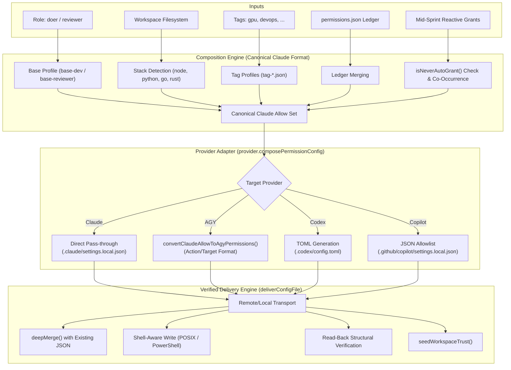

# Architecture & Specification: `compose_permissions` & AGY Provider Correction

**Document Status:** Approved Design  
**Target Component:** `apra-fleet` MCP Server (`src/tools/compose-permissions.ts`, `src/providers/agy.ts`)  
**Reference Baseline:** Claude Code Provider (`src/providers/claude.ts`)  

---

## 1. Executive Summary

In Apra-Fleet, the `compose_permissions` tool is the single source of truth for provisioning least-privilege security boundaries to autonomous agents (*members*). It computes a composite permission set from roles (`doer` vs. `reviewer`), auto-detected technology stacks (Node, Python, Go, etc.), custom tags, and persistent project ledgers.

While the core composition engine uses **Claude Code's permission syntax as its canonical baseline**, each LLM provider adapter translates and writes those permissions to its native configuration files.

### 1.1 The Problem
The current implementation of the **AGY (Antigravity CLI) Provider** in `src/providers/agy.ts` is architecturally flawed:
1. It erroneously assumes AGY has no per-project configuration mechanism, documented in `agy.ts`:
   > *"AGY has no per-project config: it reads permissions only from the machine-global ~/.gemini/antigravity-cli/settings.json... A copy written under the member's work folder is never read..."*
2. It writes all permissions directly into the machine-wide `~/.gemini/antigravity-cli/settings.json`.
3. This creates **cross-member security leakage** (e.g. a restricted `reviewer` inherits a `doer`'s broad shell execution grants), destroys project isolation, and contaminates the host machine's interactive user settings.

### 1.2 The Solution
Antigravity natively implements project-scoped permissions via its project registry at `~/.gemini/config/projects/<project-id>.json`. This document:
- Details the general `compose_permissions` architecture.
- Critiques the current global implementation.
- Analyzes key corner cases (duplicate project files, permission unioning, deterministic naming).
- Outlines a robust, un-conflicted **"Claim & Purge"** specification to fix the AGY provider without tracking extra detached UUIDs.

---

## 2. Core Architecture: `compose_permissions`

Apra-Fleet decouples permission *composition* from permission *delivery*. 



### 2.1 The Claude Baseline
All policy definitions in `skills/fleet/profiles/` are expressed in Claude Code format:
- **Filesystem Tools:** `Read`, `Write`, `Edit`, `Glob`, `Grep`
- **Path-Scoped Filesystem:** `Write(docs/**)`, `Edit(feedback.md)`
- **Shell Tools:** `Bash(git:*)`, `Bash(npm test:*)`
- **MCP Tools:** `mcp__<server>__<tool>` (e.g. `mcp__apra-fleet__kb_query`)

### 2.2 Hard Safety Constraints
When reactive grants (`grant: [...]`) are requested, `src/tools/compose-permissions.ts` enforces non-bypassable constraints:
1. **Wildcard Denylist:** Reject commands matching `Bash(sudo*)`, `Bash(su *)`, `Bash(doas*)`, `Bash(*bash -c*)`, `Bash(*sh -c*)`, `Bash(*eval*)`, `Bash(chmod 777*)`, `Bash(nc*)`, `Bash(nmap*)`, `Bash(env*)`.
2. **Chaining Metacharacters:** Rejects any payload containing `|`, `;`, `&&`, backticks (`` ` ``), or `$(`.
3. **Catch-All Ban:** Rejects bare wildcards like `Bash(*)`.

### 2.3 Delivery Engine & Verification
`deliverConfigFile` guarantees remote delivery integrity:
- **Transport Independence:** Executes identically via `LocalStrategy` (child_process) or `RemoteStrategy` (SSH).
- **Non-Destructive Deep Merge:** Preserves existing keys (such as `mcpServers.apra-fleet-member` JWT tokens).
- **Read-Back Verification:** Re-reads the file from disk, parses the JSON, and compares against `stableStringify(mergedContent)`. If anything mismatches, it throws `ConfigDeliveryError` and rolls back ledger updates.

---

## 3. Critique of Current AGY Provider Implementation

The current AGY provider implementation in `src/providers/agy.ts` contains serious architectural and security defects.

### 3.1 The Flawed Assumption
Lines 372-380 of `src/providers/agy.ts`:
```typescript
permissionConfigPaths(): string[] {
  // HOME-anchored, not work-folder-relative. AGY has no per-project config:
  // it reads permissions only from the machine-global
  // ~/.gemini/antigravity-cli/settings.json (same finding as
  // ensureWorkspaceTrusted's "no per-project trust concept"). A copy written
  // under the member's work folder is never read, so the member ran with an
  // empty allow-list and every headless tool call was auto-denied.
  return ['~/.gemini/antigravity-cli/settings.json'];
}
```

The author realized that writing to `<workFolder>/.gemini/...` did not work, and deduced that AGY had *no per-project configuration at all*. This conclusion was incorrect.

### 3.2 Consequences of Writing to Global `settings.json`

| Failure Mode | Mechanism | Impact |
| :--- | :--- | :--- |
| **Cross-Member Contamination** | Member A (`doer`) and Member B (`reviewer`) run on the same VM/host. | Member B inherits all of Member A's global `command(...)` and `write_file(*)` grants. Reviewer read-only containment is completely broken. |
| **Race Conditions** | Multiple AGY members provisioned concurrently. | Simultaneous read-modify-write operations on `~/.gemini/antigravity-cli/settings.json` corrupt or overwrite each other's permissions. |
| **User Environment Contamination** | A human developer uses `agy` on the same machine. | The human's personal CLI profile is permanently polluted with automated fleet member allow-rules, bypassing their own interactive approval gates. |
| **Trust Seeding Disabled** | `ensureWorkspaceTrusted` is stubbed out as a no-op returning `seeded: false`. | If the workspace has not been manually approved in `trustedWorkspaces`, unattended `agy` invocations can halt on interactive trust prompts. |

---

## 4. Deep-Dive Corner Cases & Critical Nuances

### 4.1 What Happens When a Folder is Found in Multiple Project JSON Files?

A crucial question arises: **If two or more `.json` files in `~/.gemini/config/projects/` contain the same `folderUri`, does AGY union their permissions, or is it an error?**

#### 1. AGY Does NOT Union Permissions
In Antigravity's architecture, each conversation and CLI execution session is bound to **exactly one Project ID**:
```
project: switching to conversation belonging to project ID: <id>
ReloadPermissions: project <id>
```
Permissions are evaluated strictly within the active project's `PermissionGrantStore`. There is **no cross-project unioning**.

#### 2. It Does NOT Throw an Error (Silent Discard)
AGY will not crash or throw an error when multiple project files share the same `folderUri`. We observed this directly in live production environments, where identical workspace roots existed across multiple UUID files (e.g., one created as a plain `folderUri` and another with `gitFolder`).

#### 3. How AGY Resolves the Conflict (The Danger)
When `resolveProject` or `chooseMainProject` searches for a project matching a workspace directory:
- It iterates through the loaded projects.
- When duplicates match the same `folderUri`, it picks **only one** (typically sorting by most recent `ModTime` / `updated_at`, or taking the first match in directory traversal order).
- **The Silent Failure:** If Apra-Fleet writes permissions to `project-A.json`, but AGY's internal resolver picks `project-B.json`, **none of the composed permissions will take effect**. The member will execute with an empty or stale grant list and fail on tool execution.

> [!CAUTION]
> Duplicate project files referencing the same `folderUri` represent a dangerous race condition. To guarantee deterministic permission enforcement, any duplicate or spurious project files for that directory **must be actively purged**.

---

### 4.2 Deterministic Naming: Eliminating "Extra UUID" Overhead

Rather than generating a random UUID and having to track or remember it:
1. Every fleet member already has an immutable, unique identifier (`agent.id`, e.g., `agent-1727145600000-xxxx` or a UUID).
2. AGY's project ID validator (`IsValidProjectID`) accepts alphanumeric slug strings with hyphens (e.g. `default-cli-project.json`).
3. We can name the project file deterministically based on the member identity:
   ```
   ~/.gemini/config/projects/fleet-${agent.id}.json
   ```
4. **Benefits of Deterministic Naming:**
   - **$O(1)$ Resolution:** `permissionConfigPaths(agent)` computes the exact file path instantly without scanning the filesystem on every turn or dispatch.
   - **Zero State Tracking:** No secondary mapping database or metadata cache is needed to connect a member to its AGY project file.
   - **Immediate Cleanliness:** Inspecting `~/.gemini/config/projects/` immediately identifies which file belongs to which fleet agent.

---

### 4.3 The "Claim & Purge" Provisioning Protocol

To solve both duplicate project file conflicts and avoid repetitive scanning:

```mermaid
flowchart TD
    Start[Provision Member / Compose Permissions] --> ComputePath["Compute Deterministic Path:\n~/.gemini/config/projects/fleet-${agent.id}.json"]
    ComputePath --> ScanDupes["Scan ~/.gemini/config/projects/*.json for folderUri"]
    
    ScanDupes --> FoundDupes{Are there other files with same folderUri?}
    FoundDupes -->|Yes| Purge["Delete Spurious Duplicate Files (rm -f)"]
    FoundDupes -->|No| CheckTarget{Does fleet-${agent.id}.json exist?}
    
    Purge --> CheckTarget
    CheckTarget -->|No| CreateSkeleton["Write Skeleton fleet-${agent.id}.json with folderUri / gitFolder"]
    CheckTarget -->|Yes| ApplyGrants["Deep-Merge Composed permissionGrants into fleet-${agent.id}.json"]
    CreateSkeleton --> ApplyGrants
    ApplyGrants --> Verify["Read-Back Verification & seedWorkspaceTrust()"]
    Verify --> Done[Execution Ready]
```

1. **Step 1: Compute Deterministic Target:**
   Target is `~/.gemini/config/projects/fleet-${agent.id}.json`.
2. **Step 2: Sweep & Purge Conflicting Project Files:**
   Query `~/.gemini/config/projects/*.json` for any file matching `file://${normalizedWorkFolder}` where `id != fleet-${agent.id}`. If any exist, delete them over the strategy transport.
3. **Step 3: Write / Update the Authoritative Project File:**
   Write the project configuration with proper `gitFolder` wrapping and `permissionGrants`.
4. **Step 4: Seed Workspace Trust:**
   Ensure `workFolder` is in `trustedWorkspaces` in `~/.gemini/antigravity-cli/settings.json`.

---

### 4.4 Git vs. Non-Git Workspaces: Protobuf oneof Safety & Worktree Support

A critical question is whether a single project configuration file can safely define both `gitFolder` and `folderUri` nodes simultaneously to hedge against uncertainty.

#### 1. Inside the Same Resource Object: Strictly Prohibited by Protobuf Schema
In Antigravity's underlying protobuf definition (`exa.project_pb.Resource`):
```protobuf
message Resource {
  oneof type {
    string folder_uri = 1;
    Google3 google3 = 2;
    GitFolder git_folder = 3;
  }
}
```
Because `type` is a Protobuf **`oneof`**, setting both `folderUri` and `gitFolder` in the same JSON object is a fatal schema violation. When Go's `protojson.Unmarshal` parses the file, it rejects it with:
```text
cannot set multiple fields in oneof "type": "folder_uri" and "git_folder"
```
This causes AGY to mark the file as corrupted (`ReloadPermissions: project <id> corrupted or unreadable`) and silently discard all permissions. Therefore, **co-locating both keys inside a single resource object is strictly forbidden**.

#### 2. As Multiple Elements in the resources Array: Redundant Roots Hazard
While having two array elements in `resources` (`[{gitFolder: ...}, {folderUri: ...}]`) is valid protobuf syntax, in AGY `resources` defines the set of top-level workspace roots. Having two entries for the identical directory path leads AGY to treat the project as a multi-root workspace with duplicate roots, risking double-indexing and redundant file watchers.

#### 3. Why 'test -d .git' Fails on Git Worktrees
In Apra-Fleet, members frequently execute within **Git Worktrees** (e.g. parallel sprint sandboxes). In a Git worktree, `.git` is **a regular text file** containing a `gitdir:` reference, NOT a directory! A naive shell test like `test -d "${workFolder}/.git"` evaluates to false, erroneously classifying an active Git worktree as a non-git folder.

#### 4. The Robust Solution: VCS Probing and In-Place Morphing
To achieve 100% safety across all workspace types (standard clones, worktrees, monorepo subfolders, and plain folders):

1. **Accurate Git Probing:** Use Git's native plumbing command:
   ```bash
   git -C "${workFolder}" rev-parse --is-inside-work-tree 2>/dev/null
   ```
   If this exits 0 and prints `true`, the folder is guaranteed to be a Git workspace (even in worktrees and monorepos). Otherwise, it is a plain folder.
2. **Deterministic Single Resource:**
   - If Git: Write `resources: [{ gitFolder: { folderUri: "file://${workFolder}", allowWrite: true } }]`.
   - If Non-Git: Write `resources: [{ folderUri: "file://${workFolder}" }]`.
3. **In-Place Morphing via Pre-Dispatch Rule:**
   Because Apra-Fleet enforces that `compose_permissions` is called before **EVERY** dispatch, if a plain folder is later initialized with `git init` during a task, the subsequent `compose_permissions` run automatically detects the new Git state and updates `resources[0]` in-place inside `fleet-${agent.id}.json` without altering the project ID or losing permission grants.

---

## 5. Target Design & Implementation Specification

### 5.1 Project Schema Definition
The generated project file at `~/.gemini/config/projects/fleet-${agent.id}.json` conforms to:

```json
{
  "id": "fleet-agent-1727145600000-abcd",
  "name": "/home/akhil/git/my-repo",
  "projectResources": {
    "resources": [
      {
        "gitFolder": {
          "folderUri": "file:///home/akhil/git/my-repo",
          "allowWrite": true
        }
      }
    ]
  },
  "permissionGrants": {
    "permissionGrants": {
      "allow": [
        "read_file(*)",
        "write_file(*)",
        "command(git)",
        "command(npm)",
        "command(npm test)",
        "mcp(apra-fleet/kb_query)"
      ],
      "deny": [],
      "ask": []
    }
  }
}
```

### 5.2 Mapping Rules for Reviewer vs Doer

Under this corrected architecture, AGY achieves genuine role isolation:

#### A. Doer Role
- `read_file(*)`
- `write_file(*)`
- `command(...)` for build, test, package management, and standard CLI tools
- `mcp(...)` tools for fleet interaction

#### B. Reviewer Role
- `read_file(*)`
- Path-scoped writes only: `write_file(docs)`, `write_file(feedback.md)`, `write_file(progress.json)`
- Read-only inspection commands: `command(git)`, `command(diff)`, `command(cat)`, `command(grep)`
- Test execution only: `command(npm test)` (NO general `npm install`, `touch`, `rm`, or `chmod`)

---

## 6. Implementation Blueprint

### Step 1: Update `ProviderAdapter` Interface (`src/providers/provider.ts`)
Allow `permissionConfigPaths` to accept the target agent:

```typescript
export interface ProviderAdapter {
  // Pass agent to allow dynamic, per-member path resolution
  permissionConfigPaths(agent?: Agent): Promise<string[]> | string[];
}
```

### Step 2: Implement Project Resolver & Purge in `src/providers/agy.ts`

```typescript
export class AgyProvider extends BaseProviderAdapter {
  private getProjectConfigFileName(agent: Agent): string {
    return `fleet-${agent.id}.json`;
  }

  async resolveAndClaimProjectConfigFile(agent: Agent, strategy: AgentStrategy): Promise<string> {
    const homeDir = await getMemberHomeDir(agent);
    const isWindows = (agent.os ?? 'linux') === 'windows';
    const normalizedFolder = agent.workFolder.replace(/\\/g, '/').replace(/\/+$/, '');
    const folderUri = `file://${normalizedFolder.startsWith('/') ? '' : '/'}${normalizedFolder}`;
    
    const targetFileName = this.getProjectConfigFileName(agent);
    const targetRelPath = `~/.gemini/config/projects/${targetFileName}`;
    const targetAbsPath = `${homeDir}/.gemini/config/projects/${targetFileName}`;

    // 1. Purge spurious duplicate files matching this folderUri
    const purgeScript = `python3 -c '
import os, glob, json, sys
home, target_uri, target_file = sys.argv[1], sys.argv[2], sys.argv[3]
p_dir = os.path.join(home, ".gemini", "config", "projects")
if os.path.isdir(p_dir):
    for f in glob.glob(os.path.join(p_dir, "*.json")):
        if os.path.basename(f) == target_file:
            continue
        try:
            with open(f) as fp:
                d = json.load(fp)
                for r in d.get("projectResources", {}).get("resources", []):
                    uri = r.get("folderUri") or r.get("gitFolder", {}).get("folderUri")
                    if uri == target_uri:
                        os.remove(f)
                        print(f"purged:{f}")
        except Exception:
            pass
' "${homeDir}" "${folderUri}" "${targetFileName}" 2>/dev/null || true`;

    await strategy.execCommand(purgeScript, 10000);

    // 2. Check if target file already exists; if not, create initial skeleton
    const checkTargetCmd = isPosixShell(isWindows, agent.shell)
      ? `test -f "${targetAbsPath}" && echo "1" || echo "0"`
      : `if (Test-Path "${targetAbsPath.replace(/\//g, '\\')}") { "1" } else { "0" }`;
    const targetExistsRes = await strategy.execCommand(checkTargetCmd, 5000);
    const targetExists = targetExistsRes.stdout.trim() === '1';

    if (!targetExists) {
      // Check if .git directory exists
      const checkGitCmd = isPosixShell(isWindows, agent.shell)
        ? `test -d "${agent.workFolder}/.git" && echo "1" || echo "0"`
        : `if (Test-Path "${agent.workFolder}\\.git") { "1" } else { "0" }`;
      const gitRes = await strategy.execCommand(checkGitCmd, 5000);
      const isGit = gitRes.stdout.trim() === '1';

      const projectId = `fleet-${agent.id}`;
      const resourceObj = isGit
        ? { gitFolder: { folderUri, allowWrite: true } }
        : { folderUri };

      const initialSkeleton = {
        id: projectId,
        name: agent.workFolder,
        projectResources: {
          resources: [resourceObj]
        },
        permissionGrants: {
          permissionGrants: {
            allow: [],
            deny: [],
            ask: []
          }
        }
      };

      await strategy.execCommand(`mkdir -p "${homeDir}/.gemini/config/projects"`, 5000);
      const writeCmd = `cat > "${targetAbsPath}" << 'FLEET_EOF'\n${JSON.stringify(initialSkeleton, null, 2)}\nFLEET_EOF`;
      await strategy.execCommand(writeCmd, 5000);
    }

    return targetRelPath;
  }

  async permissionConfigPaths(agent?: Agent): Promise<string[]> {
    if (!agent) {
      return ['~/.gemini/config/projects/fleet-default.json'];
    }
    const strategy = getStrategy(agent);
    const projectPath = await this.resolveAndClaimProjectConfigFile(agent, strategy);
    return [projectPath];
  }

  composePermissionConfig(_role: 'doer' | 'reviewer', allow: string[] = []): Array<Record<string, unknown> | string> {
    const agyAllow = formatAgyPermissionRules(convertClaudeAllowToAgyPermissions(allow));
    return [
      {
        permissionGrants: {
          permissionGrants: {
            allow: agyAllow,
            deny: [],
            ask: []
          }
        }
      }
    ];
  }
}
```

### Step 3: Implement Real `ensureWorkspaceTrusted` in `src/providers/agy.ts`

Replace the no-op with real trust seeding in `~/.gemini/antigravity-cli/settings.json`:

```typescript
async ensureWorkspaceTrusted(
  workFolder: string,
  execCommand: WorkspaceTrustExecFn,
  agentOs: 'linux' | 'macos' | 'windows' = 'linux',
  shell?: MemberShell
): Promise<EnsureWorkspaceTrustedResult> {
  const homeDir = await this.resolveHomeDir(execCommand, agentOs, shell);
  const settingsPath = `${homeDir}/.gemini/antigravity-cli/settings.json`;

  const script = `python3 -c '
import os, json, sys
p = sys.argv[1]
wf = sys.argv[2]
data = {}
if os.path.exists(p):
    try:
        with open(p) as f: data = json.load(f)
    except: pass
trusted = set(data.get("trustedWorkspaces", []))
if wf not in trusted:
    trusted.add(wf)
    data["trustedWorkspaces"] = sorted(list(trusted))
    os.makedirs(os.path.dirname(p), exist_ok=True)
    with open(p, "w") as f: json.dump(data, f, indent=2)
    print("seeded")
else:
    print("already_trusted")
' "${settingsPath}" "${workFolder}" 2>/dev/null || true`;

  const res = await execCommand(script, 5000);
  const seeded = res.stdout.includes('seeded');
  return { seeded, detail: `agy: trustedWorkspaces updated in ${settingsPath}` };
}
```

---

## 7. Migration & Verification Strategy

1. **Global Clean-up:**
   When the new implementation lands, a one-time cleanup removes stale `command(...)` and `write_file(...)` entries from global `~/.gemini/antigravity-cli/settings.json` left behind by legacy runs.
2. **Integration Verification:**
   - Provision an AGY member with role `reviewer`.
   - Verify that `~/.gemini/config/projects/fleet-${agent.id}.json` is created with path-scoped writes and read-only shell commands.
   - Verify that any duplicate/stale project files for that directory were purged.
   - Verify that `~/.gemini/antigravity-cli/settings.json` remains clean and free of member-specific allow-rules.
   - Run a sprint dispatch and confirm that `git` or write attempts outside of `docs/**` are blocked.
   - Provision a second AGY member on the same machine with role `doer` on a different repository. Confirm that each member operates within its own `fleet-${agent.id}.json` file without cross-talk.
