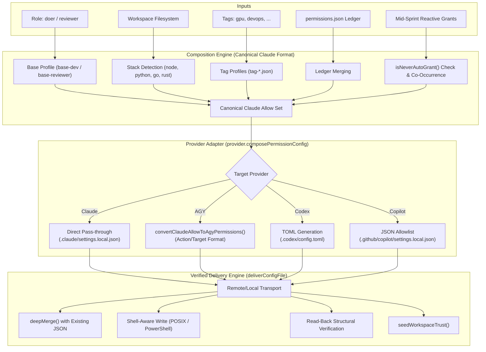

# Architecture & Specification: `compose_permissions` & AGY Provider Correction

**Document Status:** Approved Design -- PARTLY SUPERSEDED. Sections 4.1-4.4, 5.1 (file naming and resource form) and 7 assume AGY picks a project by matching the workspace folder. Live tests disproved that; see section 8 for the verified mechanism (explicit `--project <id>`), which replaces them.  
**Target Component:** `apra-fleet` MCP Server (`src/tools/compose-permissions.ts`, `src/providers/agy.ts`)  
**Reference Baseline:** Claude Code Provider (`src/providers/claude.ts`)  

---

## 1. Executive Summary

In Apra-Fleet, the `compose_permissions` tool is the single source of truth for provisioning least-privilege security boundaries to autonomous agents (*members*). It computes a composite permission set from roles (`doer` vs. `reviewer`), auto-detected technology stacks (Node, Python, Go, etc.), custom tags, and persistent project ledgers.

While the core composition engine uses **Claude Code's permission syntax as its canonical baseline**, each LLM provider adapter translates and writes those permissions to its native configuration files.

### 1.1 The Problem
The current implementation of the **AGY (Antigravity CLI) Provider** in `src/providers/agy.ts` is architecturally flawed:
1. It erroneously assumes AGY has no per-project configuration mechanism, documented in `agy.ts`:
   > *"AGY has no per-project config: it reads permissions only from the machine-global ~/.gemini/antigravity-cli/settings.json... A copy written under the member's work folder is never read..."*
2. It writes all permissions directly into the machine-wide `~/.gemini/antigravity-cli/settings.json`.
3. This creates **cross-member security leakage** (e.g. a restricted `reviewer` inherits a `doer`'s broad shell execution grants), destroys project isolation, and contaminates the host machine's interactive user settings.

### 1.2 The Solution
Antigravity natively implements project-scoped permissions via its project registry at `~/.gemini/config/projects/<project-id>.json`. This document:
- Details the general `compose_permissions` architecture.
- Critiques the current global implementation.
- Analyzes key corner cases (duplicate project files, permission unioning, deterministic naming).
- Outlines a robust, un-conflicted **"Claim & Purge"** specification to fix the AGY provider without tracking extra detached UUIDs.

---

## 2. Core Architecture: `compose_permissions`

Apra-Fleet decouples permission *composition* from permission *delivery*. 



### 2.1 The Claude Baseline
All policy definitions in `skills/fleet/profiles/` are expressed in Claude Code format:
- **Filesystem Tools:** `Read`, `Write`, `Edit`, `Glob`, `Grep`
- **Path-Scoped Filesystem:** `Write(docs/**)`, `Edit(feedback.md)`
- **Shell Tools:** `Bash(git:*)`, `Bash(npm test:*)`
- **MCP Tools:** `mcp__<server>__<tool>` (e.g. `mcp__apra-fleet__kb_query`)

### 2.2 Hard Safety Constraints
When reactive grants (`grant: [...]`) are requested, `src/tools/compose-permissions.ts` enforces non-bypassable constraints:
1. **Wildcard Denylist:** Reject commands matching `Bash(sudo*)`, `Bash(su *)`, `Bash(doas*)`, `Bash(*bash -c*)`, `Bash(*sh -c*)`, `Bash(*eval*)`, `Bash(chmod 777*)`, `Bash(nc*)`, `Bash(nmap*)`, `Bash(env*)`.
2. **Chaining Metacharacters:** Rejects any payload containing `|`, `;`, `&&`, backticks (`` ` ``), or `$(`.
3. **Catch-All Ban:** Rejects bare wildcards like `Bash(*)`.

### 2.3 Delivery Engine & Verification
`deliverConfigFile` guarantees remote delivery integrity:
- **Transport Independence:** Executes identically via `LocalStrategy` (child_process) or `RemoteStrategy` (SSH).
- **Non-Destructive Deep Merge:** Preserves existing keys (such as `mcpServers.apra-fleet-member` JWT tokens).
- **Read-Back Verification:** Re-reads the file from disk, parses the JSON, and compares against `stableStringify(mergedContent)`. If anything mismatches, it throws `ConfigDeliveryError` and rolls back ledger updates.

---

## 3. Critique of Current AGY Provider Implementation

The current AGY provider implementation in `src/providers/agy.ts` contains serious architectural and security defects.

### 3.1 The Flawed Assumption
Lines 372-380 of `src/providers/agy.ts`:
```typescript
permissionConfigPaths(): string[] {
  // HOME-anchored, not work-folder-relative. AGY has no per-project config:
  // it reads permissions only from the machine-global
  // ~/.gemini/antigravity-cli/settings.json (same finding as
  // ensureWorkspaceTrusted's "no per-project trust concept"). A copy written
  // under the member's work folder is never read, so the member ran with an
  // empty allow-list and every headless tool call was auto-denied.
  return ['~/.gemini/antigravity-cli/settings.json'];
}
```

The author realized that writing to `<workFolder>/.gemini/...` did not work, and deduced that AGY had *no per-project configuration at all*. This conclusion was incorrect.

### 3.2 Consequences of Writing to Global `settings.json`

| Failure Mode | Mechanism | Impact |
| :--- | :--- | :--- |
| **Cross-Member Contamination** | Member A (`doer`) and Member B (`reviewer`) run on the same VM/host. | Member B inherits all of Member A's global `command(...)` and `write_file(*)` grants. Reviewer read-only containment is completely broken. |
| **Race Conditions** | Multiple AGY members provisioned concurrently. | Simultaneous read-modify-write operations on `~/.gemini/antigravity-cli/settings.json` corrupt or overwrite each other's permissions. |
| **User Environment Contamination** | A human developer uses `agy` on the same machine. | The human's personal CLI profile is permanently polluted with automated fleet member allow-rules, bypassing their own interactive approval gates. |
| **Trust Seeding Disabled** | `ensureWorkspaceTrusted` is stubbed out as a no-op returning `seeded: false`. | If the workspace has not been manually approved in `trustedWorkspaces`, unattended `agy` invocations can halt on interactive trust prompts. |

---

## 4. Deep-Dive Corner Cases & Critical Nuances

### 4.1 What Happens When a Folder is Found in Multiple Project JSON Files?

A crucial question arises: **If two or more `.json` files in `~/.gemini/config/projects/` contain the same `folderUri`, does AGY union their permissions, or is it an error?**

#### 1. AGY Does NOT Union Permissions
In Antigravity's architecture, each conversation and CLI execution session is bound to **exactly one Project ID**:
```
project: switching to conversation belonging to project ID: <id>
ReloadPermissions: project <id>
```
Permissions are evaluated strictly within the active project's `PermissionGrantStore`. There is **no cross-project unioning**.

#### 2. It Does NOT Throw an Error (Silent Discard)
AGY will not crash or throw an error when multiple project files share the same `folderUri`. We observed this directly in live production environments, where identical workspace roots existed across multiple UUID files (e.g., one created as a plain `folderUri` and another with `gitFolder`).

#### 3. How AGY Resolves the Conflict (The Danger)
When `resolveProject` or `chooseMainProject` searches for a project matching a workspace directory:
- It iterates through the loaded projects.
- When duplicates match the same `folderUri`, it picks **only one** (typically sorting by most recent `ModTime` / `updated_at`, or taking the first match in directory traversal order).
- **The Silent Failure:** If Apra-Fleet writes permissions to `project-A.json`, but AGY's internal resolver picks `project-B.json`, **none of the composed permissions will take effect**. The member will execute with an empty or stale grant list and fail on tool execution.

> [!CAUTION]
> Duplicate project files referencing the same `folderUri` represent a dangerous race condition. To guarantee deterministic permission enforcement, any duplicate or spurious project files for that directory **must be actively purged**.

---

### 4.2 Deterministic Naming: Eliminating "Extra UUID" Overhead

Rather than generating a random UUID and having to track or remember it:
1. Every fleet member already has an immutable, unique identifier (`agent.id`, e.g., `agent-1727145600000-xxxx` or a UUID).
2. AGY's project ID validator (`IsValidProjectID`) accepts alphanumeric slug strings with hyphens (e.g. `default-cli-project.json`).
3. We can name the project file deterministically based on the member identity:
   ```
   ~/.gemini/config/projects/fleet-${agent.id}.json
   ```
4. **Benefits of Deterministic Naming:**
   - **$O(1)$ Resolution:** `permissionConfigPaths(agent)` computes the exact file path instantly without scanning the filesystem on every turn or dispatch.
   - **Zero State Tracking:** No secondary mapping database or metadata cache is needed to connect a member to its AGY project file.
   - **Immediate Cleanliness:** Inspecting `~/.gemini/config/projects/` immediately identifies which file belongs to which fleet agent.

---

### 4.3 The "Claim & Purge" Provisioning Protocol

To solve both duplicate project file conflicts and avoid repetitive scanning:

```mermaid
flowchart TD
    Start[Provision Member / Compose Permissions] --> ComputePath["Compute Deterministic Path:\n~/.gemini/config/projects/fleet-${agent.id}.json"]
    ComputePath --> ScanDupes["Scan ~/.gemini/config/projects/*.json for folderUri"]
    
    ScanDupes --> FoundDupes{Are there other files with same folderUri?}
    FoundDupes -->|Yes| Purge["Delete Spurious Duplicate Files (rm -f)"]
    FoundDupes -->|No| CheckTarget{Does fleet-${agent.id}.json exist?}
    
    Purge --> CheckTarget
    CheckTarget -->|No| CreateSkeleton["Write Skeleton fleet-${agent.id}.json with folderUri / gitFolder"]
    CheckTarget -->|Yes| ApplyGrants["Deep-Merge Composed permissionGrants into fleet-${agent.id}.json"]
    CreateSkeleton --> ApplyGrants
    ApplyGrants --> Verify["Read-Back Verification & seedWorkspaceTrust()"]
    Verify --> Done[Execution Ready]
```

1. **Step 1: Compute Deterministic Target:**
   Target is `~/.gemini/config/projects/fleet-${agent.id}.json`.
2. **Step 2: Sweep & Purge Conflicting Project Files:**
   Query `~/.gemini/config/projects/*.json` for any file matching `file://${normalizedWorkFolder}` where `id != fleet-${agent.id}`. If any exist, delete them over the strategy transport.
3. **Step 3: Write / Update the Authoritative Project File:**
   Write the project configuration with proper `gitFolder` wrapping and `permissionGrants`.
4. **Step 4: Seed Workspace Trust:**
   Ensure `workFolder` is in `trustedWorkspaces` in `~/.gemini/antigravity-cli/settings.json`.

---

### 4.4 Git vs. Non-Git Workspaces: Protobuf oneof Safety & Worktree Support

A critical question is whether a single project configuration file can safely define both `gitFolder` and `folderUri` nodes simultaneously to hedge against uncertainty.

#### 1. Inside the Same Resource Object: Strictly Prohibited by Protobuf Schema
In Antigravity's underlying protobuf definition (`exa.project_pb.Resource`):
```protobuf
message Resource {
  oneof type {
    string folder_uri = 1;
    Google3 google3 = 2;
    GitFolder git_folder = 3;
  }
}
```
Because `type` is a Protobuf **`oneof`**, setting both `folderUri` and `gitFolder` in the same JSON object is a fatal schema violation. When Go's `protojson.Unmarshal` parses the file, it rejects it with:
```text
cannot set multiple fields in oneof "type": "folder_uri" and "git_folder"
```
This causes AGY to mark the file as corrupted (`ReloadPermissions: project <id> corrupted or unreadable`) and silently discard all permissions. Therefore, **co-locating both keys inside a single resource object is strictly forbidden**.

#### 2. As Multiple Elements in the resources Array: Redundant Roots Hazard
While having two array elements in `resources` (`[{gitFolder: ...}, {folderUri: ...}]`) is valid protobuf syntax, in AGY `resources` defines the set of top-level workspace roots. Having two entries for the identical directory path leads AGY to treat the project as a multi-root workspace with duplicate roots, risking double-indexing and redundant file watchers.

#### 3. Why 'test -d .git' Fails on Git Worktrees
In Apra-Fleet, members frequently execute within **Git Worktrees** (e.g. parallel sprint sandboxes). In a Git worktree, `.git` is **a regular text file** containing a `gitdir:` reference, NOT a directory! A naive shell test like `test -d "${workFolder}/.git"` evaluates to false, erroneously classifying an active Git worktree as a non-git folder.

#### 4. The Robust Solution: VCS Probing and In-Place Morphing
To achieve 100% safety across all workspace types (standard clones, worktrees, monorepo subfolders, and plain folders):

1. **Accurate Git Probing:** Use Git's native plumbing command:
   ```bash
   git -C "${workFolder}" rev-parse --is-inside-work-tree 2>/dev/null
   ```
   If this exits 0 and prints `true`, the folder is guaranteed to be a Git workspace (even in worktrees and monorepos). Otherwise, it is a plain folder.
2. **Deterministic Single Resource:**
   - If Git: Write `resources: [{ gitFolder: { folderUri: "file://${workFolder}", allowWrite: true } }]`.
   - If Non-Git: Write `resources: [{ folderUri: "file://${workFolder}" }]`.
3. **In-Place Morphing via Pre-Dispatch Rule:**
   Because Apra-Fleet enforces that `compose_permissions` is called before **EVERY** dispatch, if a plain folder is later initialized with `git init` during a task, the subsequent `compose_permissions` run automatically detects the new Git state and updates `resources[0]` in-place inside `fleet-${agent.id}.json` without altering the project ID or losing permission grants.

---

## 5. Target Design & Implementation Specification

### 5.1 Project Schema Definition
The generated project file at `~/.gemini/config/projects/fleet-${agent.id}.json` conforms to:

```json
{
  "id": "fleet-agent-1727145600000-abcd",
  "name": "/home/akhil/git/my-repo",
  "projectResources": {
    "resources": [
      {
        "gitFolder": {
          "folderUri": "file:///home/akhil/git/my-repo",
          "allowWrite": true
        }
      }
    ]
  },
  "permissionGrants": {
    "permissionGrants": {
      "allow": [
        "read_file(*)",
        "write_file(*)",
        "command(git)",
        "command(npm)",
        "command(npm test)",
        "mcp(apra-fleet/kb_query)"
      ],
      "deny": [],
      "ask": []
    }
  }
}
```

### 5.2 Mapping Rules for Reviewer vs Doer

Under this corrected architecture, AGY achieves genuine role isolation:

#### A. Doer Role
- `read_file(*)`
- `write_file(*)`
- `command(...)` for build, test, package management, and standard CLI tools
- `mcp(...)` tools for fleet interaction

#### B. Reviewer Role
- `read_file(*)`
- Path-scoped writes only: `write_file(docs)`, `write_file(feedback.md)`, `write_file(progress.json)`
- Read-only inspection commands: `command(git)`, `command(diff)`, `command(cat)`, `command(grep)`
- Test execution only: `command(npm test)` (NO general `npm install`, `touch`, `rm`, or `chmod`)

---

## 6. Implementation Architecture

### Step 1: Update `ProviderAdapter` Interface (`src/providers/provider.ts`)
Allow `permissionConfigPaths` and `composePermissionConfig` to accept the target agent and Git status, and add the optional `preparePermissionsDelivery` hook:

```typescript
export interface ProviderAdapter {
  /** Optional hook called during compose_permissions before config delivery to clean up
   *  or migrate provider-specific configuration artifacts (e.g. AGY claim & purge of
   *  conflicting project UUID files). */
  preparePermissionsDelivery?(agent: Agent, execCommand: WorkspaceTrustExecFn, memberHomeDir?: string | null): Promise<void>;

  // Permission configuration
  /** Returns the config file path(s) for this provider's permission config (relative to repo root or home-anchored).
   *  Parallel to the array returned by composePermissionConfig(). */
  permissionConfigPaths(agent?: Agent): string[];

  /** Returns provider-native permission config for the given role.
   *  Each element corresponds to the path at the same index in permissionConfigPaths().
   *  JSON providers return Record<string, unknown>; TOML providers return a string. */
  composePermissionConfig(
    role: 'doer' | 'reviewer',
    allow?: string[],
    agent?: Agent,
    isGit?: boolean,
  ): Array<Record<string, unknown> | string>;
}
```

### Step 2: Implement Project Configuration & Claim & Purge in `src/providers/agy.ts`

```typescript
  permissionConfigPaths(agent?: Agent): string[] {
    if (!agent || !agent.id) {
      throw new Error('AGY provider requires a valid Agent with an id to compose permission config');
    }
    return [`~/.gemini/config/projects/fleet-${agent.id}.json`];
  }

  composePermissionConfig(
    _role: 'doer' | 'reviewer',
    allow: string[] = [],
    agent?: Agent,
    isGit = true,
  ): Array<Record<string, unknown> | string> {
    if (!agent || !agent.id || !agent.workFolder) {
      throw new Error('AGY provider requires a valid Agent with workFolder to compose permission config');
    }
    const agyAllow = formatAgyPermissionRules(convertClaudeAllowToAgyPermissions(allow));
    const workFolder = agent.workFolder.replace(/\\/g, '/').replace(/\/+$/, '');
    const id = `fleet-${agent.id}`;
    const uri = toAgyFileUri(agent.workFolder);

    const resource = isGit
      ? { gitFolder: { folderUri: uri, allowWrite: true } }
      : { folderUri: uri };

    return [{
      id,
      name: workFolder,
      projectResources: {
        resources: [resource],
      },
      permissionGrants: {
        permissionGrants: {
          allow: agyAllow,
          deny: [],
          ask: [],
        },
      },
    }];
  }

  async purgeConflictingProjects(
    agent: Agent,
    execCommand: WorkspaceTrustExecFn,
    memberHomeDir?: string | null,
    agentOs: 'linux' | 'macos' | 'windows' = 'linux',
    shell?: MemberShell,
  ): Promise<string[]> {
    if (!agent || !agent.workFolder) {
      throw new Error('AGY provider requires a valid Agent with workFolder to purge conflicting projects');
    }
    const targetUri = toAgyFileUri(agent.workFolder);
    const keepId = `fleet-${agent.id}`;
    const cmd = buildAgyPurgeCommand(targetUri, keepId, memberHomeDir, agentOs, shell);
    const result = await execCommand(cmd, 10000);
    if (result.code !== 0) {
      throw new Error(`agy: purgeConflictingProjects failed with exit code ${result.code}: ${result.stderr || result.stdout}`);
    }
    if (result.stdout) {
      try {
        const parsed = JSON.parse(result.stdout.trim());
        if (parsed && typeof parsed === 'object') {
          const purged = Array.isArray(parsed.purged) ? parsed.purged : [];
          const warnings = Array.isArray(parsed.warnings) ? parsed.warnings : [];
          if (warnings.length > 0) {
            logWarn(
              'agy',
              `Non-fleet project config file(s) [${warnings.join(', ')}] also target "${agent.workFolder}". Fleet project fleet-${agent.id}.json will take precedence.`
            );
          }
          if (purged.length > 0) {
            logWarn(
              'agy',
              `Purged (renamed to .bak) ${purged.length} conflicting project config(s) for ${agent.workFolder}: ${purged.join(', ')}`
            );
          }
          return purged;
        }
      } catch (e) {
        logWarn('agy', `Failed to parse purgeConflictingProjects stdout: ${result.stdout}`);
      }
    }
    return [];
  }

  async preparePermissionsDelivery(
    agent: Agent,
    execCommand: WorkspaceTrustExecFn,
    memberHomeDir?: string | null,
    agentOs: 'linux' | 'macos' | 'windows' = 'linux',
    shell?: MemberShell,
  ): Promise<void> {
    await this.purgeConflictingProjects(agent, execCommand, memberHomeDir, agentOs, shell);
    await cleanGlobalAgySettings(execCommand, memberHomeDir, agentOs, shell);
  }
```

### Step 3: Implement Real `ensureWorkspaceTrusted` in `src/providers/agy.ts`

Seeds `workFolder` into `trustedWorkspaces` in `~/.gemini/antigravity-cli/settings.json`:

```typescript
  async ensureWorkspaceTrusted(
    workFolder: string,
    execCommand: WorkspaceTrustExecFn,
    agentOs: 'linux' | 'macos' | 'windows' = 'linux',
    shell?: MemberShell,
    _transport?: WorkspaceTrustTransport,
  ): Promise<EnsureWorkspaceTrustedResult> {
    const normFolder = workFolder.replace(/\\/g, '/').replace(/\/+$/, '');
    const usePosix = isPosixShell(agentOs, shell);
    const isWindows = !usePosix;
    const homeFile = isWindows
      ? '$env:USERPROFILE\\.gemini\\antigravity-cli\\settings.json'
      : '$HOME/.gemini/antigravity-cli/settings.json';
    const settingsDir = isWindows
      ? '$env:USERPROFILE\\.gemini\\antigravity-cli'
      : '$HOME/.gemini/antigravity-cli';

    const readCmd = isWindows
      ? `Get-Content -Raw "${homeFile}" -ErrorAction SilentlyContinue`
      : `cat "${homeFile}" 2>/dev/null || true`;

    const readResult = await execCommand(readCmd, 5000);
    let settings: Record<string, unknown> = {};
    try {
      const parsed = JSON.parse(readResult.stdout.trim());
      if (parsed && typeof parsed === 'object' && !Array.isArray(parsed)) {
        settings = parsed;
      }
    } catch {
      // missing or invalid JSON
    }

    const trusted = Array.isArray(settings.trustedWorkspaces)
      ? (settings.trustedWorkspaces as string[])
      : [];

    if (trusted.includes(normFolder)) {
      return { seeded: false, detail: `agy: workspace "${normFolder}" already in trustedWorkspaces` };
    }

    const updatedTrusted = [...trusted, normFolder];
    settings.trustedWorkspaces = updatedTrusted;
    const contentStr = JSON.stringify(settings, null, 2);

    const mkdirCmd = isWindows
      ? `if (-not (Test-Path "${settingsDir}")) { New-Item -ItemType Directory -Force "${settingsDir}" }`
      : `mkdir -p "${settingsDir}"`;
    await execCommand(mkdirCmd, 5000);

    const writeCmd = isWindows
      ? `[System.IO.File]::WriteAllText("${homeFile}", '${contentStr.replace(/'/g, "''")}', (New-Object System.Text.UTF8Encoding($false)))`
      : `cat > "${homeFile}" << 'FLEET_AGY_SETTINGS_EOF'\n${contentStr}\nFLEET_AGY_SETTINGS_EOF`;

    const writeResult = await execCommand(writeCmd, 5000);
    if (writeResult.code !== 0) {
      throw new Error(`agy: failed to write trustedWorkspaces to settings.json (exit ${writeResult.code})`);
    }

    return { seeded: true, detail: `agy: added "${normFolder}" to trustedWorkspaces in settings.json` };
  }
```

---

## 7. Migration & Verification Strategy

1. **Global Clean-up:**
   When the new implementation lands, a one-time cleanup removes stale `command(...)` and `write_file(...)` entries from global `~/.gemini/antigravity-cli/settings.json` left behind by legacy runs.
2. **Integration Verification:**
   - Provision an AGY member with role `reviewer`.
   - Verify that `~/.gemini/config/projects/fleet-${agent.id}.json` is created with path-scoped writes and read-only shell commands.
   - Verify that any duplicate/stale project files for that directory were purged.
   - Verify that `~/.gemini/antigravity-cli/settings.json` remains clean and free of member-specific allow-rules.
   - Run a sprint dispatch and confirm that `git` or write attempts outside of `docs/**` are blocked.
   - Provision a second AGY member on the same machine with role `doer` on a different repository. Confirm that each member operates within its own `fleet-${agent.id}.json` file without cross-talk.

---

## 8. Live-Verified Correction: Explicit Project Binding (`--new-project` / `--project`)

**Status:** verified live on 2026-09-26 (Windows, agy 1.2.11, fleet-agy-local, deployed build v0.4.3_3e5f82). Supersedes sections 4.1-4.4, the naming and resource parts of 5.1, and section 7.

### 8.1 Finding

A headless `agy -p ... --add-dir <workFolder>` run does **not** pick a project by matching `<workFolder>` against the `projectResources` of the files in `~/.gemini/config/projects/`. Without `--project`, it runs under `default-cli-project` (the grants in `default-cli-project.json`). A project file that points at the work folder is ignored, whatever its file name, resource form or grant shape.

The project is bound explicitly:

1. `agy --new-project -p "<prompt>" --output-format json` creates a new project `~/.gemini/config/projects/<uuid>.json` and runs the prompt in it. `agy --help`: `--new-project  Create a new project for this session`. The owner's run printed `Your **Antigravity Project ID** is: e6d3551b-02a1-455d-8578-2f9424b4d71e` and created `e6d3551b-02a1-455d-8578-2f9424b4d71e.json`.
2. Every later run passes `--project <uuid>`. `agy --help`: `--project  Project ID or project name for the current CLI session`. Only then are that file's `permissionGrants` enforced.

### 8.2 Evidence

Same prompt every time ("run `git status --short --branch`"), fleet's own command line (`cd <wf> && agy --add-dir <wf> --model <m> --output-format json -p ... --mode accept-edits`), work folder `C:\akhil\git\apra-fleet-agy`.

| # | Project files present | Grants / resource | `--project` | Result |
|---|---|---|---|---|
| 1 | default only | default: none | no | denied (`denied_actions: [command]`) |
| 2 | default + `fleet-<agent.id>.json` from compose_permissions | nested, 34 allow incl. `command(git)`, `gitFolder file:///C:/...` | no | denied |
| 3 | same file, minimal | nested, `command(git)` only | no | denied |
| 4 | same file, minimal | **flat** `permissionGrants.allow`, `command(git)` | no | denied |
| 5 | default edited | default: nested `command(*)` | no | **allowed** |
| 6 | default emptied + `blah-blah.json` | nested `command(git)` etc., `folderUri file://C:/...` | no | denied |
| 7 | default emptied + `e6d3551b-....json` (created by `--new-project`) | nested `read_file(*)`, `command(*)`, `folderUri file://C:/...` | **yes** | **allowed** (conv 8c304b3b) |
| 8 | identical to 7 | identical | no | denied (conv 6b24f112) |

Runs 7 and 8 differ only in `--project`, so `--project` is what binds the grants. Run 5 shows why grants seemed to "leak": without `--project`, every headless run on the machine shares `default-cli-project.json`.

Other facts established:
- The nested shape `permissionGrants.permissionGrants.{allow,deny,ask}` is what agy reads (runs 5 and 7). The flat shape is not needed.
- On a denial agy exits 0 with `status: "SUCCESS"`, `response: ""`, `denied_actions: [...]` on stdout, and an "auto-denied" line on stderr. Fleet must read these (separate bead); today it reports `empty_response`.
- On Linux (fleet-lin-agy), `git status` is checked as the `unsandboxed` action, not `command` (`permission check failed for unsandboxed "git status ..."`). Grants for Linux members therefore probably need `unsandboxed(...)` rules. Not yet verified.

### 8.3 Design

1. **Create the project when a member becomes an agy member**: on register_member with llm_provider agy, and on update_member switching to agy. Run `agy --new-project -p "<fixed prompt asking for the project id>" --output-format json` on the member, in its work folder. Take the id from the new `<uuid>.json` that appeared in `~/.gemini/config/projects/` (list before and after; exactly one new file), and cross-check it against the id in the response text. Fail registration loudly if that is not exactly one id.
2. **Store it on the member** in registry.json, e.g. `agyProjectId` (the owner's name for it is ANTIGRAVITY_PROJECT_ID; use the registry's camelCase convention). Existing agy members without it are provisioned on the next compose_permissions or execute_prompt (upgrade path), never silently skipped.
3. **compose_permissions writes only `<agyProjectId>.json`**, in the schema verified by run 7:
   ```json
   {
     "id": "<agyProjectId>",
     "name": "<work folder basename>",
     "projectResources": { "resources": [ { "folderUri": "<work folder URI>" } ] },
     "permissionGrants": { "permissionGrants": { "allow": [ ... ], "deny": [ ... ] } }
   }
   ```
   It keeps `id`, `name` and `projectResources` as agy wrote them and replaces only `permissionGrants`. It never touches other project files or `default-cli-project.json`.
4. **Every agy dispatch passes `--project <agyProjectId>`** (execute_prompt, and any other place fleet runs agy for a member). A missing id is a hard error, not a silent fallback to `default-cli-project`.

### 8.4 What this makes obsolete

These exist only because of the disproved folder-matching assumption. They should be removed (tracked by a bead):
- deterministic `fleet-<agent.id>.json` naming (4.2);
- "Claim & Purge" (`purgeConflictingProjects`, `buildAgyPurgeScript` / `buildAgyPurgeCommand`, `.bak` renames): it touched files that agy never used for our runs, including the user's own projects;
- the `gitFolder` vs `folderUri` morphing and git probing (4.4, `requiresGitAwareness`, `detectIsGit`), unless open question 2 shows `projectResources` matters;
- URI normalization used only for matching (`toAgyFileUri` comparisons in purge);
- the design's assumption in 7 that per-member files give cross-member isolation without `--project`.

### 8.5 Open questions (verify live before relying on them)

1. Grammar: does `command(git)` match `git status --short --branch`? Only `command(*)` has been proven with `--project`.
2. Does `projectResources` matter once `--project` is given (workspace scope, write access), or is `--add-dir` enough? Run 7 used `file://C:/...` (two slashes) and still worked.
3. Linux: the `unsandboxed(...)` action. Does a `command(...)` grant cover it, or do Linux grants need `unsandboxed(...)`?
4. Does `--new-project` need `--dangerously-skip-permissions`, and can the creating call avoid a model turn? Can `--project <name>` create or select by name?
5. What does agy do if the `<id>.json` file is deleted or corrupt while the id is still passed? Fleet should detect it and re-provision.
6. Do workspace trust (`trustedWorkspaces`) and the global-settings clean-up still matter under this model?
