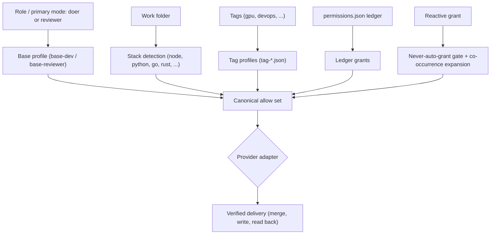

# compose_permissions design

`compose_permissions` is how fleet gives a member a least-privilege permission
set. It **composes** one canonical allow list and then **delivers** it in the
member's provider-native format, verified on disk.

---

## 1. Composition

The canonical format is Claude Code's permission syntax:

- file tools: `Read`, `Write`, `Edit`, `Glob`, `Grep`, optionally path-scoped
  (`Write(docs/**)`, `Edit(feedback.md)`);
- shell: `Bash(git:*)` (a command prefix), `Bash(npm test)` (an exact command
  line);
- MCP tools: `mcp__<server>__<tool>` (e.g. `mcp__apra-fleet__kb_query`).


```mermaid
flowchart TD
    R[Role / primary mode: doer or reviewer] --> Base["Base profile (base-dev / base-reviewer)"]
    S[Work folder] --> Stack["Stack detection (node, python, go, rust, ...)"]
    T["Tags (gpu, devops, ...)"] --> Tag["Tag profiles (tag-*.json)"]
    L["permissions.json ledger"] --> Ledger["Ledger grants"]
    G["Reactive grant"] --> Gate["Never-auto-grant gate + co-occurrence expansion"]
    Base --> Allow[Canonical allow set]
    Stack --> Allow
    Tag --> Allow
    Ledger --> Allow
    Gate --> Allow
    Allow --> Adapter{Provider adapter}
    Adapter --> Deliver["Verified delivery (merge, write, read back)"]
```

- **Full compose** (`role` and/or `tags`): base profile for the primary mode,
  plus stack profiles for the detected stacks, plus tag profiles, plus the
  project ledger's past grants. The merge is additive and order-independent.
- **Reactive grant** (`grant: [...]`): adds specific permissions to what the
  member already has, typically after a permission denial. Co-occurring
  grants are expanded (e.g. docker with docker-compose). With
  `project_folder`, each grant is recorded in the ledger so future composes
  include it.

### Never auto-granted

Every `grant` entry, from any caller, is checked against a denylist matched
by wildcard against a normalized form of the request, and rejected outright
on a hit: `sudo`/`su`/`doas`, `bash -c`/`sh -c`/`eval`, `env`/`printenv`,
`nc`/`nmap`, `chmod 777`, any catch-all such as `Bash(*)`, and any payload
containing a shell-chaining metacharacter (`|`, `;`, `&&`, backtick, `$(`).
These need a human decision.

---

## 2. Delivery

Each provider adapter converts the canonical set and names the file it lives
in:

| Provider | Target | Notes |
|---|---|---|
| Claude | `<workFolder>/.claude/settings.local.json` | Passed through as `permissions.allow`; a grant is merged into the existing list. |
| Antigravity (agy) | `~/.gemini/config/projects/<agyProjectId>.json` on the member | The member's own agy project, bound with `--project` on every dispatch. See [Antigravity (agy) provider](agy-provider.md). |
| Codex | `<workFolder>/.codex/config.toml` | Role-based approval settings. |
| Copilot | `<workFolder>/.github/copilot/settings.local.json` | JSON allow list. |
| OpenCode | `<workFolder>/.opencode/settings.json` | |

Delivery is the same for every provider and transport (local process or
SSH):

1. Resolve the target path. A home-anchored path (`~/...`) is resolved from
   the member's home directory, determined by fleet, never by shell
   expansion; if it cannot be determined, delivery fails rather than writing
   to the wrong place.
2. Read the existing file and merge the new content into it, preserving keys
   fleet does not own. On a full compose the provider's permission arrays are
   replaced by the composed set; on a reactive grant they are extended (Claude
   by merging its allow list first, agy by unioning its allow/deny arrays).
3. Write with a shell-appropriate command (POSIX or PowerShell, by the
   member's registered shell).
4. Read the file back and compare it structurally with the intended content.
   Any mismatch fails the call; the ledger is updated only after every file
   landed.

Provider-specific warnings (for example grants a provider cannot express) are
returned under `Warnings:` in the result. After delivery, workspace trust is
seeded for providers that need it (Claude).

---

## 3. The member-local Fleet MCP server

Every member also runs its **own** apra-fleet as a local MCP server (over
stdio) rather than calling back into any central server. `compose_permissions`
resolves that member's own install (`resolveMemberFleetInstall`,
`src/services/member-fleet-install.ts`) and, when it verifies one at or above
`MIN_MEMBER_FLEET_VERSION`, enables a `Fleet MCP` entry alongside the
provider's normal permission delivery -- see
[install.md](install.md#member-side-apra-fleet-prerequisite-for-kb--code-intelligence-tools)
for the prerequisite this depends on and how to satisfy it.

**Tool scope**: the shared definition in `src/providers/member-tool-scope.ts`
allows exactly 13 read/contribute tools (`kb_query`, `kb_capture`, `kb_stats`,
`kb_list`, `kb_feedback`, `kb_session_prime`, `code_graph`, `code_impact`,
`code_query`, `code_context`, `code_map`, `code_flow`, `code_tests`) and
denies everything else fleet's tool registry knows about, including the
admin-only KB tools (`kb_setup`, `kb_export`, `kb_import`, `kb_harvest`,
`kb_promote`, `kb_invalidate`, `kb_context`, `kb_freshness_sweep`,
`kb_resolve_contradiction`, `kb_reconcile_prefilter`) and every fleet-admin
tool (`register_member`, `execute_prompt`, `shutdown_server`,
`credential_store_*`, ...). Rendered per provider from that one definition
(`renderClaudeMemberMcpRules`, `renderAgyMemberMcpRules`) so the allow/deny
sets can never drift between providers. The deny rules are emitted for BOTH
the current server name (`apra-fleet`) and the retired central-server name
(`apra-fleet-member`), so a member that still carries the old entry on disk
cannot use it as a way around the allowlist.

**Outcome, always named, never silent**: `resolveMemberFleetInstall` either
verifies a usable install and returns a scoped stdio launch descriptor, or
returns one of three machine-readable unscoped reasons plus a user-actionable
remediation string (`no-install-found`, `install-unusable`, `probe-failed` --
see install.md's table). `compose_permissions`' text result always carries a
`Fleet MCP:` line reporting which happened, e.g.:

```
Fleet MCP: enabled as "apra-fleet" (member-local stdio, apra-fleet 0.4.4); tools limited to 13 kb/code tools
```

or, unscoped:

```
Fleet MCP: NOT scoped (no-install-found) -- no entry written.
    apra-fleet is not installed on member "bella"...
```

The outcome is also persisted on the member record (`Agent.memberMcpScope` in
`src/types.ts`) so later phases -- Sprint Setup preflight, the fleet panel --
can read it back without re-probing the member. `scoped: false` is a normal,
non-fatal state; it never means `compose_permissions` itself failed.

**Config shape per provider**, written only when the member is scoped:

| Provider | Where the entry lands | What is pruned every compose |
|---|---|---|
| Claude | `<workFolder>/.mcp.json` (`mcpServers.apra-fleet`) | The retired `mcpServers.apra-fleet.disabled` switch in `settings.local.json`, and the superseded `mcpServers['apra-fleet-member']` (orchestrator-URL-plus-bearer-token) entry in `.mcp.json` |
| Antigravity (agy) | `~/.gemini/config/mcp_config.json` (`mcpServers.apra-fleet`) | The superseded `mcpServers['apra-fleet-member']` entry in the same file |

Both prunes exist because a deep merge can only add or overwrite keys -- a
retired or superseded entry left on a member's disk from before this design
would otherwise survive every future compose forever, leaving the member
reading as enabled via two different (and, for the retired switch,
contradictory) mechanisms at once.
