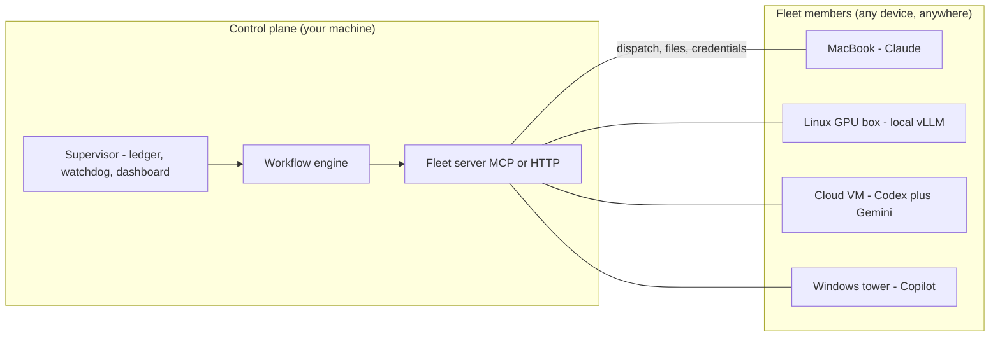

<!-- ============================================================= -->
<!-- DRAFT: complete README.md rewrite (positioning: agent fleet   -->
<!-- platform). Iterating here; promotes to /README.md at the run  -->
<!-- boundary. ASCII only per repo policy.                         -->
<!-- Graphics assets marked [GFX-n] with production specs below.   -->
<!-- ============================================================= -->

<div align="center">

[GFX-1: hero banner, full width]

# apra-fleet

**Run a fleet of AI agents across your devices, your providers, your workflows.**

What Kubernetes did for containers, apra-fleet does for AI agents:
scheduling, credentials, isolation, and observability for an agentic
workforce -- on any machine, anywhere, using every LLM provider at once.

[](https://github.com/Apra-Labs/apra-fleet/actions/workflows/ci.yml)
[](https://opensource.org/licenses/Apache-2.0)
[](https://github.com/Apra-Labs/apra-fleet/releases)
[](https://modelcontextprotocol.io)
[](https://deepwiki.com/Apra-Labs/apra-fleet)

[Quick Start](#quick-start-5-minutes) - [Live Demo](#watch-a-fleet-work) - [How It Works](#how-it-works) - [Docs](https://apra-labs.github.io/apra-fleet)

</div>

---

[GFX-2: animated GIF, the auto-sprint dashboard actually running -- agents
dispatching, phases advancing, verdicts landing. 20-30s loop.
INTERIM until that GIF is recorded on the lean viewer: the existing real
3-minute run video below.]

[](https://youtu.be/SGdHvIkSbY8)

> **This repository is built by the product you are looking at.** An
> autonomous apra-fleet workflow plans, codes, reviews, tests, and ships
> this codebase in multi-hour sprints -- filing bugs against itself and
> fixing them. The recording above is a real run, not a mockup.

---

## Why a fleet?

Running one AI agent is a demo. Running fifty -- across a MacBook in the
office, a GPU box in the lab, three cloud VMs, and your CI -- is an
operations problem nobody else has solved:

- **Which machine runs which agent?** Real devices, not throwaway sandboxes:
  registered, credentialed, health-checked members you already own.
- **Which model does which job?** Claude for review, a cheap tier for
  mechanical edits, a local vLLM model for private data -- all in one fleet,
  routed by cost tier, switchable per task.
- **Who watches the agents?** Durable workflows with supervisors, watchdogs,
  reservations, and live dashboards. Agents that die get detected. Work that
  stalls gets resumed. Nothing runs silently.
- **Who holds the keys?** Secrets entered out-of-band, never visible to any
  model. Per-provider permission composition. Network egress policy per
  credential.

One control plane. Any device. Any model. Any workflow. Any domain.

## What you get

| Pillar | Concretely |
|---|---|
| **Any device** | Register any Windows / macOS / Linux machine (local or over SSH) as a fleet member in one command. Cloud members auto-start on demand. |
| **Any model** | Claude, Codex, Gemini, Copilot, Antigravity, local models (any OpenAI-compatible endpoint via OpenCode) -- mixed freely. Tier-based routing (cheap / standard / premium) keeps cost governance built in. Cross-provider review is a quality mechanism: a different model, with different blind spots, checks every change. |
| **Any workflow** | Workflows are durable programs, not prompt chains: multi-hour, resumable, observable, with member reservations and atomic state. Write your own; ship it to the fleet. |
| **Any domain** | Not just software development. The pattern fits wherever work decomposes into agent-sized pieces that need orchestration and an audit trail: nightly retail replenishment (reconcile inventory deltas, draft purchase orders for sign-off), logistics exception handling (triage a delayed shipment, re-book, notify), healthcare intake (summarize referrals, check completeness, route), back-office runs (invoice matching, compliance evidence collection). Software engineering is the vertical running today -- your domain is a workflow away. |

[GFX-3: fleet topology diagram -- one control plane, spokes to
heterogeneous devices, each device badged with its provider(s)]

## Watch a fleet work

Our flagship workflow, **auto-sprint**, develops software autonomously:
plan -> develop -> review -> deploy -> integration-test -> harvest, in
cycles, until the goal is met or the evidence says stop.

It is not a toy. It builds apra-fleet itself:

- Multi-cycle sprints running for hours, unattended
- 2,300+ unit tests and an 81-file integration suite against real backends
- Files bugs against itself, decomposes them, fixes them, and blocks its
  own release until quality gates pass
- Every dispatch, verdict, and dollar visible live on the dashboard

A fleet that has run in production:

```
pm-1      Opus (premium)      orchestrator
doer-1    Sonnet (standard)   feature work
doer-2    Antigravity         large-context tasks
reviewer  Opus (premium)      final review
```

The engine does not know what a "sprint" is; it knows how to run your
workflow reliably across your fleet (see **Any domain** above).

## Quick start (5 minutes)

**1. Install** -- one command via npm (Node.js 22+), or grab the
standalone installer binary for your platform from
[Releases](https://github.com/Apra-Labs/apra-fleet/releases) and
double-click it (installation is the default action):

```bash
npm install -g @apralabs/apra-fleet
apra-fleet                   # installs for Claude Code (default)
apra-fleet --llm gemini      # or Antigravity/Codex/Copilot/Gemini/OpenCode
```

**2. Connect your agent.** Load the fleet server in Claude Code with
`/mcp` (or restart your provider CLI). Your agent now has a fleet.

**3. Register members -- in plain language.** apra-fleet is driven
conversationally through any MCP-capable agent:

> "Register a local member called `doer`. Register another called
> `reviewer`. Pair them."

> "Register 192.168.1.10 as `build-server`. Username akhil, work folder
> `/home/akhil/projects/myapp`."

Remote passwords are collected out-of-band -- typed into a separate
terminal, never the chat -- used once to set up SSH keys, then forgotten.

**4. Run your first workflow:**

```bash
apra-fleet workflow hello-world
```

Then point the fleet at real work:

```bash
apra-fleet workflow auto-sprint \
  --issue my-project-epic --members doer \
  --branch auto-sprint/first-run --base main
```

Open the dashboard, watch your fleet think.

## How it works

[GFX-4: architecture diagram (mermaid) -- control plane, members, providers,
workflow engine, supervisor]



- **Fleet server**: the control plane. Registers members, dispatches
  commands and prompts, moves files, brokers credentials. Speaks MCP, so
  any MCP-capable agent can drive a fleet.
- **Members**: real machines running provider CLIs. The server composes
  provider-native permissions before every dispatch; unattended modes are
  scoped, never blanket.
- **Workflow engine**: runs workflow programs with phases, retries, turn
  budgets, resumable sessions, and per-activity persistent state.
- **Supervisor**: the always-on layer -- launch and stop sprints over HTTP,
  member reservation ledger (no two workflows fight over a machine),
  crash watchdog, run history.

## Compare to alternatives

| Tool | Overlap | Where apra-fleet differs |
|------|---------|--------------------------|
| Single-agent coding assistants | AI writes code | A fleet adds agents that review, test, and deploy each other's work -- across vendors. |
| CI self-hosted runners | Runs work on other machines | Conversational and stateful, not pipeline-triggered; agents carry context between phases. |
| SkyPilot / dstack | Multi-machine compute | Coordinates agents and their context, credentials, and permissions -- not just jobs. |
| Google A2A | Agent-to-agent messaging | An opinionated orchestration and operations layer, not just a transport. |
| Agent frameworks (LangGraph, CrewAI, ...) | Multi-agent logic | Those compose agents inside one process; apra-fleet operates agents across real machines, providers, and days-long workflows. |

When NOT to use it: a one-off single-file change needs no fleet.

## Security model, in one paragraph

Secrets are entered out-of-band into a credential store and referenced as
`{{secure.NAME}}` -- resolved server-side at execution, never visible to
any LLM or log. Credentials scope to members, expire on TTL, and can carry
a network egress policy (allow / deny / confirm). Every member runs with
composed, provider-native permission files -- allow-listed tools, not
god-mode. VCS access is provisioned and revocable per member.

## The packages

| Package | What it is |
|---|---|
| `apra-fleet` | The fleet platform: server, CLI, member management, credentials, workflows runtime |
| `packages/apra-fleet-se` | The software-engineering vertical: auto-sprint engine, agent contracts, integration suites |
| `packages/apra-fleet-workflow` | Workflow authoring runtime: state, viewer, checkpointing |
| `packages/fleet-api-contract` | Typed API contract shared by server and clients |

## Status and roadmap

apra-fleet is under active development -- by its own fleet. Current focus:
hardening autonomous sprint execution (the toughest workflow we know of),
supervisor-orchestrated multi-sprint operation, and the workflow SDK for
third-party verticals.

---

<div align="center">

**Stop babysitting agents. Start operating fleets.**

[Quick Start](#quick-start-5-minutes) - [GitHub Issues](https://github.com/Apra-Labs/apra-fleet/issues) - [Apra Labs](https://apralabs.com)

</div>

<!-- ============================================================= -->
<!-- GRAPHICS PRODUCTION SPECS                                     -->
<!-- ============================================================= -->
<!--
[GFX-1] Hero banner (SVG or PNG, 1280x320, dark-first):
  Wordmark "apra-fleet" + tagline. Visual: constellation of device
  silhouettes (laptop, tower, rack, cloud) connected by orbit lines to a
  central control hexagon; small provider glyphs on each device. Subtle
  grid background. Two variants (dark/light) via GitHub picture element.

[GFX-2] Dashboard GIF (recorded, not mocked):
  Record the REAL auto-sprint viewer during a live run: phase transitions,
  a doer dispatch landing, verdict appearing. 20-30s, 1200px wide, <8MB.
  Candidate tool: claude-in-chrome gif_creator against the live viewer.
  This is the highest-credibility asset we own -- prioritize it.

[GFX-3] Fleet topology (SVG, 900px):
  One control plane node -> 4-5 heterogeneous member devices, each badged
  with provider logos + OS glyphs. Callouts: "reserved by sprint A",
  "tier: premium", "credential: scoped". Static, clean, mono-accent.

[GFX-4] Architecture: the mermaid block above renders natively on GitHub;
  keep as code (evolves with the product, diffs in PRs).

Badges: build (GH Actions), latest release, license, "providers: 5+",
platform trio. All shields.io, no custom infra.
-->
