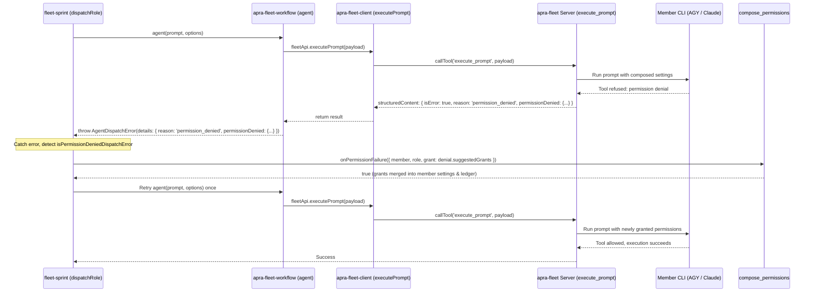

# Plan: Reactive Permission Self-Healing & Parity (Claude & AGY)

## Executive Summary

This plan addresses:
1. **Evidence regarding Claude dispatch modes**: Proves with code and test evidence that Claude dispatches in `fleet-sprint` run with `--permission-mode acceptEdits`, NOT `--dangerously-skip-permissions`.
2. **End-to-End Typed Permission Denials**: Ensures `execute_prompt` and `apra-fleet-client` return structured, typed permission errors (`PermissionDeniedError` & `permissionDenialOf`) carrying the exact `actions`, `denials`, `suggestedGrants`, `hint`, and `signals` for both AGY and Claude.
3. **Reactive Permission Self-Healing in `fleet-sprint`**: Integrates an `onPermissionFailure` callback in `runner.js` and `dispatch-role.mjs` that reacts to permission denials by calling `compose_permissions` with `grant: suggestedGrants` and retrying the failed dispatch, eliminating blind retry loops.
4. **Unblocking AGY MCP Tool Verification**: Removes legacy hardcoded gates in `member-fleet-install.ts` and `member-init-probe.mjs` so verified MCP tools provide `available` status for AGY members.
5. **Dual-device Deployment**: Rebuilds and redeploys binaries across local Windows host and remote Linux host per `deploy.md`.

---

## 1. Evidence: How Claude Runs in `fleet-sprint`

The previous claim that "Claude runs unattended dispatches with `--dangerously-skip-permissions`" is **incorrect**. The codebase proves that Claude runs under `--permission-mode acceptEdits` with permissions enforced by `.claude/settings.local.json`:

1. **`dispatchRole` does not pass `unattended`:**
   In [`packages/apra-fleet-se/fleet-sprint/dispatch-role.mjs:562-579`](file:///C:/akhil/git/apra-fleet/packages/apra-fleet-se/fleet-sprint/dispatch-role.mjs#L562-L579), the options passed to `agent()` are:
   `agentType`, `model`, `timeout_s`, `max_total_s`, `max_turns`, `schema`, `resume`, `onSessionId`, `label`, and `member_name`. There is no `unattended` option.
2. **`workflow/index.mjs` does not pass `unattended`:**
   In [`packages/apra-fleet-workflow/src/workflow/index.mjs:1170-1182`](file:///C:/akhil/git/apra-fleet/packages/apra-fleet-workflow/src/workflow/index.mjs#L1170-L1182), the payload passed to `executePrompt()` does not include `unattended`.
3. **Member registration defaults `unattended` to `false`:**
   In [`src/tools/register-member.ts:335`](file:///C:/akhil/git/apra-fleet/src/tools/register-member.ts#L335), `unattended` defaults to `false`.
4. **`src/providers/claude.ts` falls back to `acceptEdits`:**
   In [`src/providers/claude.ts:267-279`](file:///C:/akhil/git/apra-fleet/src/providers/claude.ts#L267-L279):
   ```typescript
   resolvePermissionFlag(unattended: false | 'auto' | 'dangerous' | undefined): string {
     if (unattended === 'auto') return '--permission-mode auto';
     if (unattended === 'dangerous') return '--dangerously-skip-permissions';
     return this.workspaceEditPermissionFlag() ?? '';
   }
   workspaceEditPermissionFlag(): string | null {
     return '--permission-mode acceptEdits';
   }
   ```
5. **Integration test proof:**
   In [`tests/integration/claude-integration.test.ts:76-82`](file:///C:/akhil/git/apra-fleet/tests/integration/claude-integration.test.ts#L76-L82):
   ```typescript
   it('falls back to acceptEdits permission mode for headless dispatch with no unattended flag', () => {
     const cmd = provider.buildPromptCommand({
       folder: '/home/user/workspace',
       promptFile: '.fleet-task.md',
     });
     expect(cmd).toContain('--permission-mode acceptEdits');
   });
   ```
6. **Implication:**
   Under `--permission-mode acceptEdits`, Claude auto-approves file edits inside the work folder, but **all commands (Bash, MCP tools) require matching entries in `.claude/settings.local.json`** composed by `compose_permissions`.

---

## 2. Architecture & Data Flow



---

## 3. Concrete Changes Required

### Layer 1: Provider-level Denial Detection for Claude & AGY
- **AGY (`src/providers/agy.ts`)**: Already implements `detectAgyPermissionDenial` parsing JSON, stderr, and transcript to produce `PermissionDenial`.
- **Claude (`src/providers/claude.ts`)**: Add `detectClaudePermissionDenial(result: SSHExecResult): PermissionDenial | undefined`.
  - Parses Claude Code tool execution results and stderr for denied tool calls (`Bash(...)`, `mcp__apra-fleet__...`).
  - Maps denied commands to suggested grants (`Bash(<bin>:*)`, `Bash(<exact>)`, `mcp__...`).
  - Sets `parsed.permissionDenial` so `execute-prompt.ts` returns the identical structured `permission_denied` payload.

### Layer 2: Client Error Typing (`packages/apra-fleet-client`)
- In [`packages/apra-fleet-client/src/client/errors.mjs`](file:///C:/akhil/git/apra-fleet/packages/apra-fleet-client/src/client/errors.mjs):
  Define `PermissionDeniedError extends ClientError`:
  - `code: 'PERMISSION_DENIED'`
  - `permissionDenied: PermissionDenied`
  - `actions: string[]`
  - `denials: PermissionDenialItem[]`
  - `suggestedGrants: string[]`
  - `hint: string`
- In [`packages/apra-fleet-client/src/client/api.mjs`](file:///C:/akhil/git/apra-fleet/packages/apra-fleet-client/src/client/api.mjs):
  - Expand `permissionDenialOf(resultOrError)` to inspect `resultOrError.details?.permissionDenied`, `resultOrError.permissionDenied`, and `resultOrError.structuredContent?.permissionDenied`.
  - Export `permissionErrorOf(resultOrError): PermissionDeniedError | null`.

### Layer 3: Workflow Layer (`packages/apra-fleet-workflow`)
- In [`packages/apra-fleet-workflow/src/workflow/index.mjs`](file:///C:/akhil/git/apra-fleet/packages/apra-fleet-workflow/src/workflow/index.mjs):
  - Attach `permissionDenied` directly on `AgentDispatchError.permissionDenied` in addition to `details.permissionDenied`.

### Layer 4: Sprint Engine Reactive Self-Healing (`packages/apra-fleet-se/fleet-sprint`)
- In [`packages/apra-fleet-se/fleet-sprint/errors.mjs`](file:///C:/akhil/git/apra-fleet/packages/apra-fleet-se/fleet-sprint/errors.mjs):
  - Export `isPermissionDeniedDispatchError(err): boolean`.
  - Export `permissionDenialOfError(err): PermissionDenial | null`.
  - Include `'permission_denied'` in `isNonRetryableDispatchError(err)`.
- In [`packages/apra-fleet-se/fleet-sprint/member-provisioning.mjs`](file:///C:/akhil/git/apra-fleet/packages/apra-fleet-se/fleet-sprint/member-provisioning.mjs):
  - Implement `createPermissionSelfHealCallback({ callTool, log, projectFolder })`:
    - Converts sprint role (`'planner'`, `'doer'`, `'reviewer'`) to base profile mode (`'doer'` / `'reviewer'`).
    - Calls `fleetApi.composePermissions({ member_name, role: baseRole, grant: denial.suggestedGrants, grant_reason, project_folder })`.
    - Returns `true` if permissions were composed and delivered.
- In [`packages/apra-fleet-se/fleet-sprint/runner.js`](file:///C:/akhil/git/apra-fleet/packages/apra-fleet-se/fleet-sprint/runner.js):
  - Construct `onPermissionFailure` in `runSprintCycle` and pass it into `dispatchCtx`.
- In [`packages/apra-fleet-se/fleet-sprint/dispatch-role.mjs`](file:///C:/akhil/git/apra-fleet/packages/apra-fleet-se/fleet-sprint/dispatch-role.mjs):
  - In the dispatch catch block, check `isPermissionDeniedDispatchError(err)`.
  - If `ctx.onPermissionFailure` is present, call it with the error denial.
  - If healed, log the grant and `continue` to retry the dispatch once.
  - If unhealed, abort retries immediately (do not burn retries against an unyielding permission boundary).

### Layer 5: MCP Tool Verification Unblocking
- In [`src/services/member-fleet-install.ts`](file:///C:/akhil/git/apra-fleet/src/services/member-fleet-install.ts):
  - Remove lines 1175-1177 and 1367-1373 that hardcode AGY members to `unavailable`.
- In [`packages/apra-fleet-se/fleet-sprint/member-init-probe.mjs`](file:///C:/akhil/git/apra-fleet/packages/apra-fleet-se/fleet-sprint/member-init-probe.mjs):
  - Remove line 419 that forces `'no-per-project-mcp'`.

---

## 4. Build and Deployment Protocol (`deploy.md`)

1. **Local Host (Windows):**
   - Run `node scripts/preflight-clear-build-locks.mjs`
   - Run `npm ci && npm run build && npm run build:binary`
   - Run `dist/apra-fleet-installer-win-x64.exe install --force --llm agy`
2. **Remote Host (Linux):**
   - Commit changes to `feat/agy-agent-transform-tests` and push to remote git repository.
   - Over SSH on `utubovyu.users.openrport.io` in `/home/akhil/git/fleet-agy`:
     `git pull && npm ci && npm run build && npm run build:binary && dist/apra-fleet-installer-linux-x64 install --force --llm agy`
3. **Verification:**
   - Execute sprint or probe to verify AGY member MCP tools and reactive self-heal on any missing permissions.
