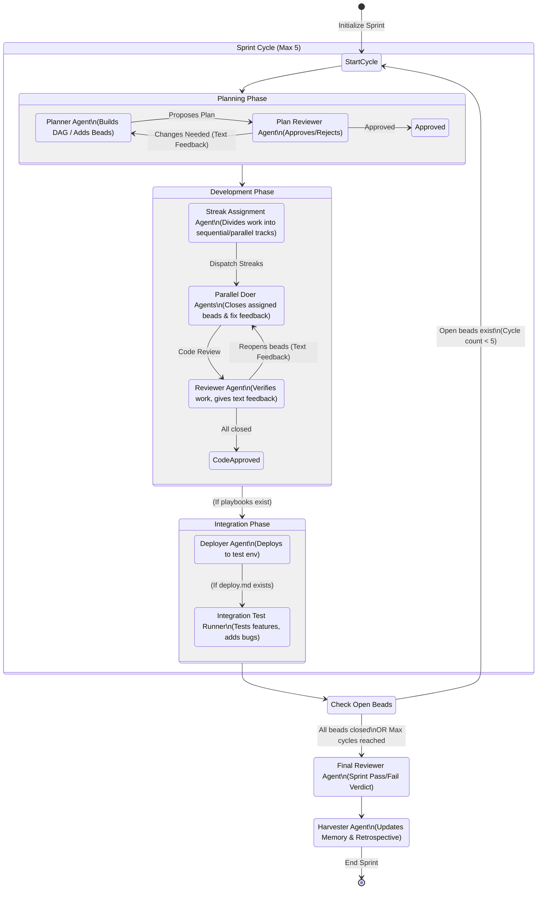

# Auto-Sprint Workflow Architecture

This diagram illustrates the complex, multi-agent lifecycle of a single sprint. It highlights the outer iterative cycle (Sprint Cycles) and the inner tight feedback loops (Planning Loop, Development Loop).

