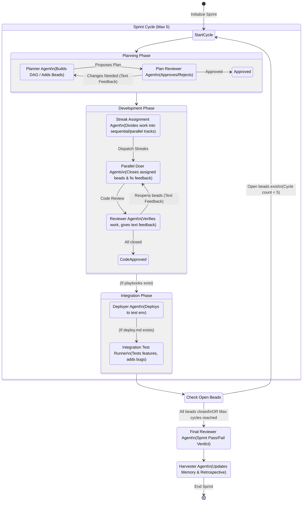

# Auto-Sprint Workflow Architecture

This diagram illustrates the complex, multi-agent lifecycle of a single sprint. It highlights the outer iterative cycle (Sprint Cycles) and the inner tight feedback loops (Planning Loop, Development Loop).

## Supported multi-member topology

The runner spreads roles across members: the orchestrator issues every `bd` command and the git push/PR, doers round-robin across the doer pool, and the reviewer runs from the reviewer pool.

Two topology modes are supported, selected explicitly at sprint start:

- **`legacy` mode** -- no cross-member sync layer. Orchestrator `bd` commands
  hit the orchestrator member's beads DB; a doer's `bd close` hits its own
  member's DB; the sprint git branch is only coherent if all members share
  the same working state. This coheres for **single-member** sprints (one
  member does everything) or a **verified shared-workspace fleet** (all
  configured members resolve to the same checkout/beads DB). Independent
  per-member checkouts are **not supported** in this mode (their `bd close`
  calls and commits would silently diverge from the orchestrator's view).
- **`synced` mode** -- orchestrator-bracketed git+Dolt sync brackets wrap
  every dispatch, reconciling each member's git and beads state explicitly
  instead of assuming it is already shared. This is what makes genuinely
  independent per-member checkouts safe.

Guards enforcing whichever mode is selected:

1. **Branch-ensure everywhere** (both modes) -- before the first doer round the runner git-ensures the sprint branch (`git fetch` + `git checkout -B`) on every member in the union of the orchestrator/doer/reviewer pools (not just the orchestrator), then non-destructively re-checks-out the branch at the start of later cycles (never resetting committed work back to base).
2. **Topology precondition** (`checkMemberTopology`, called from `bin/cli.mjs`) -- in `legacy` mode, compares `git rev-parse HEAD` across the configured members and refuses to start on a mismatch; in `synced` mode, HEADs are allowed to differ but every member must share the same git remote origin and pass a live `bd dolt pull` probe. Single-member sprints trivially pass either check.

See `packages/apra-fleet-se/docs/architecture.md` -> "Multi-member topology", "Orchestrator-bracketed git sync", and "Dolt sync discipline" for the full rationale.
